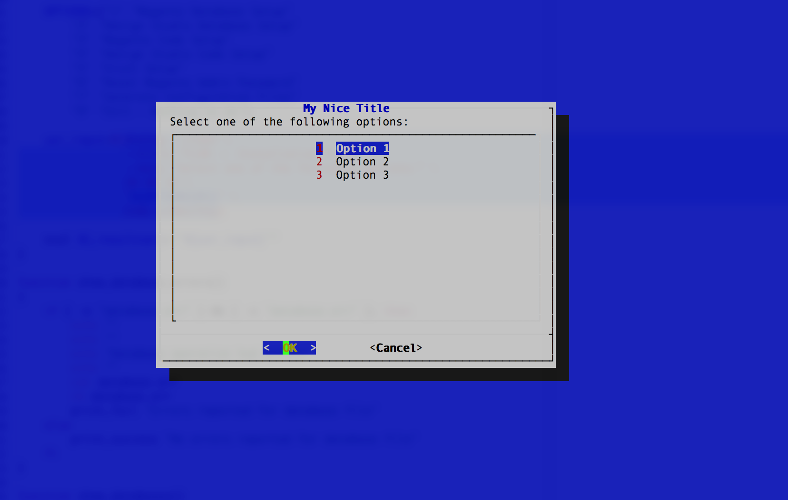

# Command Line Dialogs



## Installation

### Ubuntu

```bash
sudo apt-get install dialog
```

### Mac

```bash
brew install dialog
```

## How to use

```bash

OPTIONS=(
  1 "Option 1"
  2 "Option 2"
  3 "Option 3"
)

dialog --clear \
 --title "My Nice Title" \
 --menu "Select one of the following options:" \
  20 60 15 \
 "${OPTIONS[@]}"

 ```

### Explanation

`--clear` : Clears the widget screen, keeping only the screen_color background.
`20 60 15` : Height, Width, Inner box height 


 # How to use it as a bash function

```bash
#!/bin/bash

function get_menu_option()
{
    local _resultvar=$1

    OPTIONS=(
      1 "Option 1"
      2 "Option 2"
      3 "Option 3"
    )

    usr_input=$(dialog --clear \
        --title "FLOR :: Installation Tasks" \
        --menu "Select one of the following options:" \
        20 60 15 \
        "${OPTIONS[@]}" \
        2>&1 >/dev/tty)

    eval ${_resultvar}="'${usr_input}'"
}

get_menu_option optionSelected

if [ "${optionSelected}" == "" ]; then
    echo "You didn't selected anything"
else
    echo "You selected the option ${optionSelected}"
fi

```

