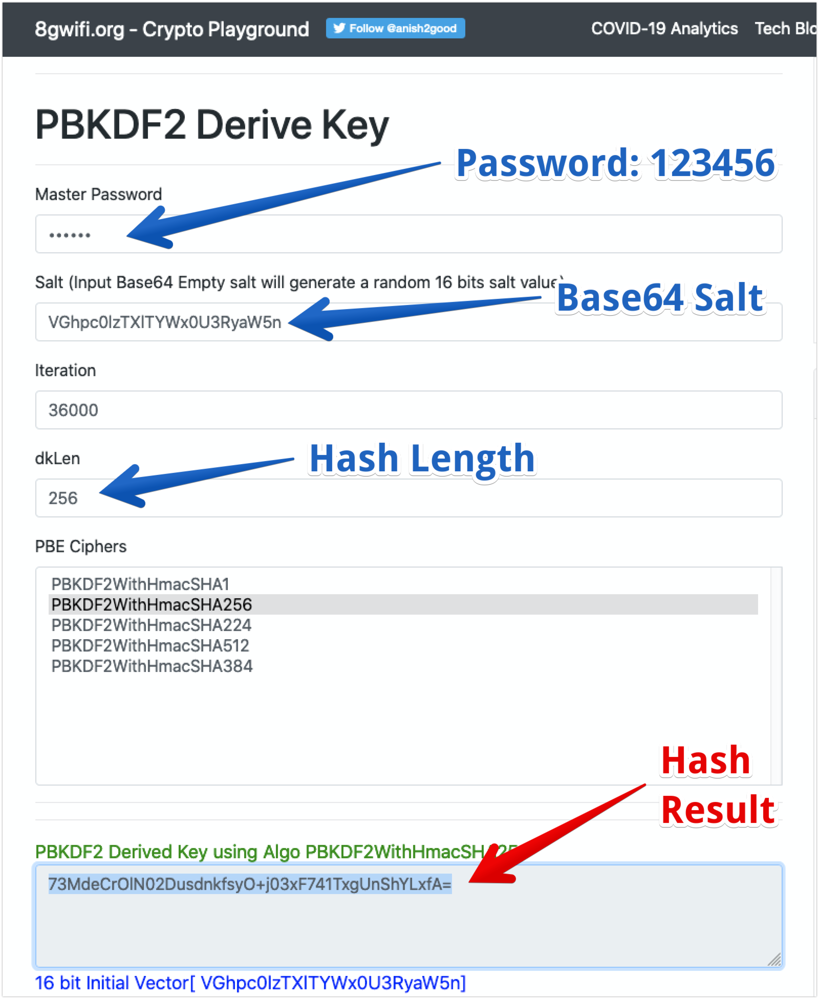

# Password management in Django

# Explanation

By default, Django store passwords using PBKDF2. The storage format is the following:

```
<algorithm>$<iterations>$<salt>$<hash>
```

So for example, the following string:
```
pbkdf2_sha256$36000$i3DheF3hbQTf$UnxcJmP3SzdDcwW7lFYzQMm916mZtu6Pb3o643/9lHA=
```

Can be parsed as follow:

```
pbkdf2_sha256  $    36000    $  i3DheF3hbQTf  $  UnxcJmP3SzdDcwW7lFYzQMm916mZtu6Pb3o643/9lHA=
algorithm       iterations         salt                    hash
```

## Steps
To generate a password, using this method, do:

1. Generate your salt
2. Convert the salt to Base64
3. Go to: https://8gwifi.org/pbkdf.jsp
4. Enter the password, salt, iterations, dklen (256) and choose PBKDF2WithHmacSHA256 as Cipher

### Base64 Conversion
To convert a string to Base64, you can use the online tool: https://www.base64encode.org/

## Example

* Password required: ```123456```
* Salt: ```ThisIsMySaltString```
* Base64 Salt: ```VGhpc0lzTXlTYWx0U3RyaW5n```

Now go to: https://8gwifi.org/pbkdf.jsp and enter the information, the result is the hash: ```73MdeCrOlN02DusdnkfsyO+j03xF741TxgUnShYLxfA=```



### Result
Parameters:

* Password required: ```123456```
* Salt: ```ThisIsMySaltString```
* Base64 Salt: ```VGhpc0lzTXlTYWx0U3RyaW5n```
* Hash: ```73MdeCrOlN02DusdnkfsyO+j03xF741TxgUnShYLxfA=```
* Iterations: ```36000```
* Algorith: ```PBKDF2_SHA256```

**Result:**
```
pbkdf2_sha256$36000$ThisIsMySaltString$73MdeCrOlN02DusdnkfsyO+j03xF741TxgUnShYLxfA=
```


# Reference
https://docs.djangoproject.com/en/3.0/topics/auth/passwords/