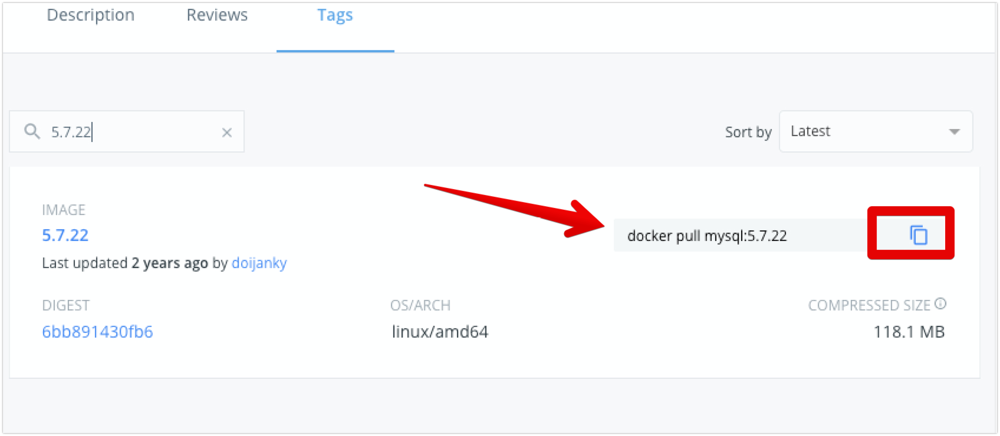

# How to run just one instance of MySQL with the version I want without installing it locally.

Well we can use Docker for that!

First, what version do you want/neeed?

Go to: https://hub.docker.com/_/mysql?tab=tags search for the version required, and copy the ```docker pull``` command. For the sake of this example, I will use MySQL 5.7.22.



Once you have the correct image do:

## 1. Pull the image

**Example with MySQL 5.7.22**
```
docker pull mysql/mysql-server:5.7.22
```

### Verify the image is present
```
docker images |grep '5.7.22'
```

## 2. Start the database
```
MYCONTAINERNAME="mycontainer"
docker run -d \
  --name=${MYCONTAINERNAME} 
  -d -p 33306:3306 \
  mysql/mysql-server:5.7.22
```

With this setup, the DB will start fresh every time it's spawn, however, if you want to keep the actual data, do:

```
mkdir -p mysqldata
mkdir -p share
MYCONTAINERNAME="mycontainer"
CURRENTDIR=$(pwd)
docker run -d \
  --name=${MYCONTAINERNAME} \
  -v ${CURRENTDIR}/mysqldata:/var/lib/mysql \
  -v ${CURRENTDIR}/share:/var/shared \
  -d -p 33306:3306 \
  mysql/mysql-server:5.7.22
```

The DB is also forwarding the port 3306 to the localhost port 33306.

# Tricks / How to's

## How do I use a brand new DB without pre-exiting content?
```
cd mysqldata
rm -Rf *
cd ..
```
Once you delete the content ot the ```mysqldata``` directory, start the DB again, this will instantiate a new setup for MySQL.

## How to view the container MySQL password?

```
docker logs ${MYCONTAINERNAME} 2>&1 | grep GENERATED
```

## How to see the logs

```
docker logs ${MYCONTAINERNAME}
```

## How to use the MySQL client

```
docker exec -it ${MYCONTAINERNAME} mysql -uroot -p
```

## How to stop the container
```
docker stop ${MYCONTAINERNAME}
```

## How to restart the container
```
docker restart ${MYCONTAINERNAME}
```

## How to delete the container
```
docker stop ${MYCONTAINERNAME}
docker rm ${MYCONTAINERNAME}
```

## How do I change the MySQL root initial password?

```
NEWPWD="123456" && \
ROOTPWD=$(docker logs ${MYCONTAINERNAME} 2>&1 | grep GENERATED |sed -E 's/^(.+) PASSWORD: //') && \
echo "Current password : ${ROOTPWD}" && \
echo "New password     : ${NEWPWD}"

docker exec -it ${MYCONTAINERNAME} \
  mysql \
  -uroot \
  -p${ROOTPWD} \
  --connect-expired-password \
  -e "ALTER USER 'root'@'localhost' IDENTIFIED BY '${NEWPWD}'"
```


