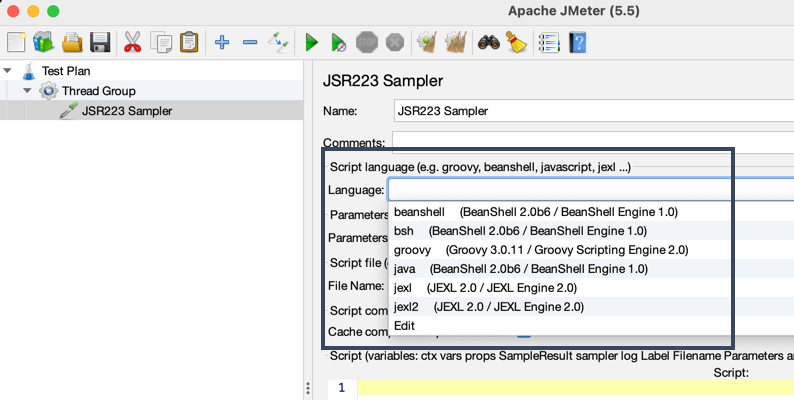
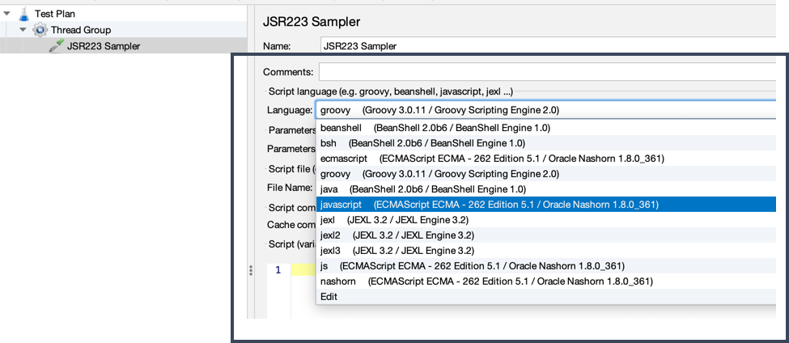
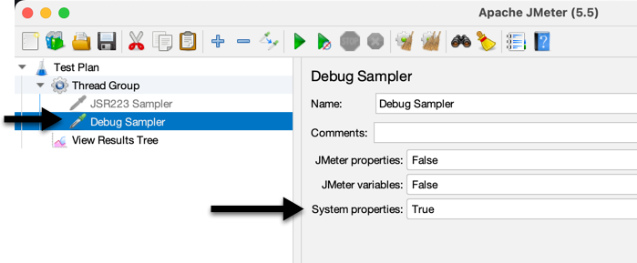
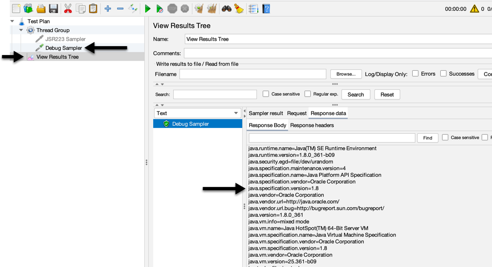

# Add JavaScript Engine to JMeter

JMeter uses the languages engines available to the system provided by Java.

**IF** in your current JMeter environment, JavaScript is not available, it's because the Java version you're using does not support it.




## What versions support JavaScript

Quick answer: Java 8.

Java SE 8 comes with the engine **Oracle Nashorn**. This engine is basd on [JSR 292](https://jcp.org/en/jsr/detail?id=292) which allows the support of dynamically typed languages in the Java Platform.

## How to Install

Go to: https://www.oracle.com/java/technologies/downloads/#java8 and download the latest Java 8 version.

## How to setup

**FOR Mac OS**

`~/.bash_profile`
```
export JAVA_VMVER="1.8"
export JAVA_HOME="$(/usr/libexec/java_home -v ${JAVA_VMVER})"
export PATH="${PATH}:${JAVA_HOME}"
```




<br>
_______________

## How can I know what Java version is JMeter using?
1. Create a JMeter plan
1. Add a Debug Sampler
1. In the Debug Sampler, set **System Properties** to `TRUE`
1. Add `View Results Tree` listener
<br>

| Debug Sampler | Listener |
|---|---|
|  |  |
<br>

<br>
_______________

## What versions do I have installed?
Run: `/usr/libexec/java_home -V`

> **What is `/usr/libexec/java_home`**?<br>
> Tool that returns the path to a Java home directory from the current user's settings.

**Example**
```
$ /usr/libexec/java_home -V
Matching Java Virtual Machines (6):
    16.0.1 (x86_64) "Oracle Corporation" - "Java SE 16.0.1" /Library/Java/JavaVirtualMachines/jdk-16.0.1.jdk/Contents/Home
    16.0.1 (x86_64) "GraalVM Community" - "GraalVM CE 21.1.0" /Library/Java/JavaVirtualMachines/graalvm-ce-java16-21.1.0/Contents/Home
    11.0.11 (x86_64) "GraalVM Community" - "GraalVM CE 21.1.0" /Library/Java/JavaVirtualMachines/graalvm-ce-java11-21.1.0/Contents/Home
    1.8.361.09 (x86_64) "Oracle Corporation" - "Java" /Library/Internet Plug-Ins/JavaAppletPlugin.plugin/Contents/Home
    1.8.0_361 (x86_64) "Oracle Corporation" - "Java SE 8" /Library/Java/JavaVirtualMachines/jdk1.8.0_361.jdk/Contents/Home
    1.8.0_292 (x86_64) "AdoptOpenJDK" - "AdoptOpenJDK 8" /Library/Java/JavaVirtualMachines/adoptopenjdk-8.jdk/Contents/Home

```

It supports the exact version or major ones:

**Get the latest 16 version installed**
```
$ /usr/libexec/java_home -v 16
/Library/Java/JavaVirtualMachines/jdk-16.0.1.jdk/Contents/Home
```

**Get the 11 version**
```
$ /usr/libexec/java_home -v 11
/Library/Java/JavaVirtualMachines/graalvm-ce-java11-21.1.0/Contents/Home
```

**Get the 1.8 version**
```
$ /usr/libexec/java_home -v 1.8
/Library/Internet Plug-Ins/JavaAppletPlugin.plugin/Contents/Home
```