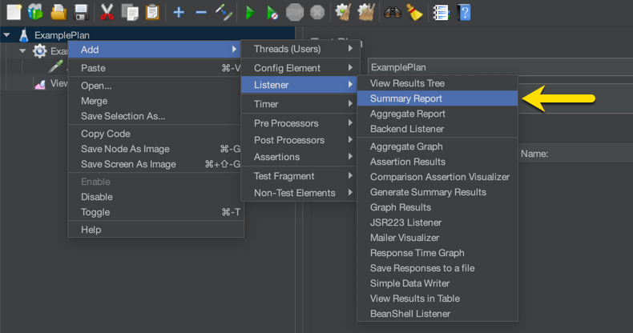
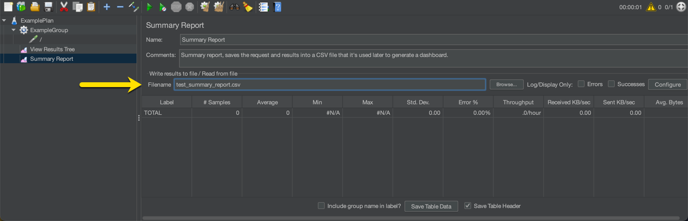
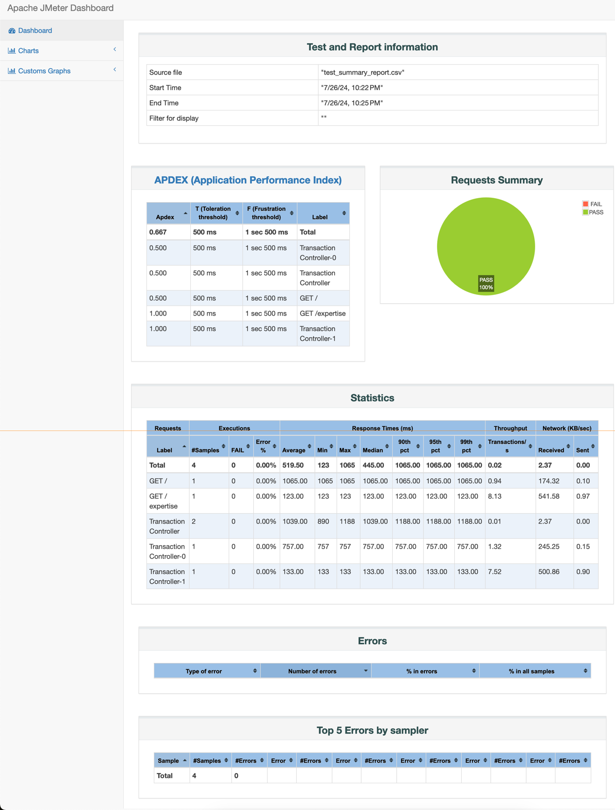

# How to Generate Jmeter Dashboards

## Summary
After a load test or any other type of test, it's possible to generate an HTML result with all the stats and graphs from the test.

## What's required?
To generate the reports, you need to create a JMeter plan and add a "Summary Report" Listener.

|  |
|:--:|
| *Right click to add the Summary Report Listener* |


### Summary Report Configuration.
Once the report is added to the test plan, you need to add the filename to save the report.

|  |
|:--:|
| *Results will be saved in test_summary_report.csv* |

### JMeter Plan Download
The plan in the screenshots can be downloaded from here: [Download :: JMeter Example](./plans/SummaryReportPlan.jmx)

## Apache JMeter Report Dashboard

### How to generate the report
Once the test is executed, you can generate the report by running the following command:

```bash
jmeter -g test_summary_report.csv -o ./report
```
This command will generate the report from the file "test_summary_report.csv" and save it in the folder "./report".

**Note**
From the JMeter help menu:
```
-g, --reportonly <argument>
       generate report dashboard only, from a test results file
-o, --reportoutputfolder <argument>
       output folder for report dashboard
```

### Download the Example
Too see an example of the report, you can download it from here: [Download :: JMeter Dashboard Example](./plans/DashboardExample.zip)

|  |
|:--:|
| *JMeter Report Dashboard - Home page* |


## References
* https://jmeter.apache.org/usermanual/generating-dashboard.html

