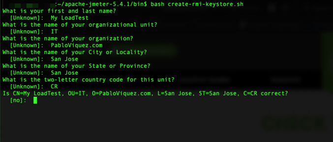
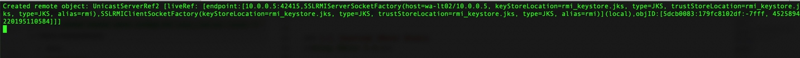

# Jmeter Master Slave Configuration

## Context & Setup
For the test I use 3 servers (Ubuntu):

* 1x Server as Master
* 2x Servers as Slaves

Their requirement is small, however it all dependes on how many threads do you want to run in terms of memory.

**Note** Since this servers are just for load testing, this setup assumes that JMeter will be downloaded in the user home and executed.

**IMPORTANT**
This setup assumes the following:
1. All test will be performed out of a directory called "loadtest".
1. Servers can talk to each other.
1. Servers are in the same subnet.
1. Ubuntu is used as OS in the servers.
1. Subnet is isolated, no other hosts (only JMeter) are running inside.

## 1. Setup

### 1.1. Network Ports
For a default JMeter setup, it's required for the machines to talk to each other using the following network rules:

Name | Port | Protocol | Source | Destination | Action
--- | --- | --- | --- | --- | ---
IncomingJmeter | `1099` | `tcp` | *SubNet* | *SubNet* | `Allow`
SSHOptional | `22` | `tcp` | *SubNet* | *SubNet* | `Allow`
OutgoingJmeter | `1024-65536` | `tcp` | *SubNet* | *SubNet* | `Allow`


### 1.2. Java RMI Setup
JMeter uses by default Java Remote Method Invocation (Java RMI) to make remote invocations over secure SSL connections.

**Hack**
JMeter has a tool to generate the required `rmi_keystore.jks` file.

The tool name is: `create-rmi-keystore.sh` inside the Jmeter bin directory.

```
cd ~/apache-jmeter-5.4.1/bin
~/apache-jmeter-5.4.1/bin$ bash create-rmi-keystore.sh
What is your first and last name?
  [Unknown]:  MyJMeterTest
What is the name of your organizational unit?
  [Unknown]:  IT
What is the name of your organization?
  [Unknown]:  PabloViquez.com
What is the name of your City or Locality?
  [Unknown]:  San Jose
What is the name of your State or Province?
  [Unknown]:  San Jose
What is the two-letter country code for this unit?
  [Unknown]:  CR
Is CN=My LoadTest, OU=IT, O=PabloViquez.com, L=San Jose, ST=San Jose, C=CR correct?
  [no]:  Yes
```



### 1.3. Servers Setup - Java & Network Tools
```
sudo apt-get udpate && \
sudo apt-get install nmap -y && \
sudo apt install net-tools -y && \
sudo apt install default-jre -y
```

### 1.3. Servers Setup - JMeter Setup
**Using JMeter 5.4.1**

```
cd ~
wget https://downloads.apache.org/jmeter/binaries/apache-jmeter-5.4.1.tgz
tar -xzvf apache-jmeter-5.4.1.tgz
```

### 1.4. Create/Append to bash profile for easy access
export JMETER_HOME="/home/pviquez/apache-jmeter-5.4.1"
export PATH="${PATH}:${JMETER_HOME}/bin"

alias INIT_SERVER="clear && cd ~/loadtest/ && bash ${JMETER_HOME}/bin/jmeter-server"

```
cd ~
cd apache-jmeter-5.4.1
_JPATH=$(pwd)
echo "export JMETER_HOME=\"${_JPATH}\"" >> ~/.bash_profile
echo "export PATH=\"${PATH}:${JMETER_HOME}/bin\"" >> ~/.bash_profile
echo "alias INIT_SERVER=\"clear && cd ~/loadtest/ && bash ${JMETER_HOME}/bin/jmeter-server\"" >> ~/.bash_profile
source ~/.bash_profile
```

## 2. Run
To run the test using master/slave do:
1. Start JMeter server on the Slaves
1. Execute the JMeter plan in the Master

**Assumptions**
For this example, I'm going to assume the following:

1. All servers are in the same subnet.
1. Connectivity between each other is good.
1. 1x Master and 2x Slaves
  1. Master IP : 10.0.0.5
  1. Slave 1 IP: 10.0.0.6
  1. Slave 2 IP: 10.0.0.7
1. JMeter plan name: `loadtest.jmx`

### 2.1 Run Slaves

```
source ~/.bash_profile
INIT_SERVER
```

Should output something like this:




### 2.2 Execute the test

**On Master** The JMeter plan was saved inside the `loadtest` directory.

```
source ~/.bash_profile
cd loadtest
${JMETER_HOME}/bin/jmeter \
-R 10.0.0.6,10.0.0.7 \
-n -t jmeter_plan_name.jmx
```

Should see an output similar to this:
```
Configuring remote engine: 10.0.0.6
Configuring remote engine: 10.0.0.7
Starting distributed test with remote engines: [10.0.0.6, 10.0.0.7] @ Fri Jun 11 21:03:50 UTC 2021 (1623445430436)
Remote engines have been started:[10.0.0.6, 10.0.0.7]
Waiting for possible Shutdown/StopTestNow/HeapDump/ThreadDump message on port 4445
summary +      3 in 00:00:06 =    0.5/s Avg:  1494 Min:  1199 Max:  1830 Err:     0 (0.00%) Active: 2 Started: 4 Finished: 2
summary +     35 in 00:00:18 =    1.9/s Avg:   722 Min:    24 Max:  9943 Err:     1 (2.86%) Active: 0 Started: 4 Finished: 4
summary =     38 in 00:00:24 =    1.6/s Avg:   783 Min:    24 Max:  9943 Err:     1 (2.63%)
Tidying up remote @ Fri Jun 11 21:04:18 UTC 2021 (1623445458614)
... end of run

```

## Hacks & Tools

I created a simple script that looks for servers in the subnet. All using the same structure as detailed in this post.

Create a new file called: `run_test.sh` and save it inside the directory `loadtest` with the following content:

```
# ---------------------------------------------------------------------
# -- JMeter Helper Tool
# --
# -- Simple script that looks for servers in the network and runs
# -- a test plan.
# --
# -- Assumes that:
# --   Only JMeter slave servers are running the same subnet
# --   The server is capable of broadcasting messages in the network
# --
# --
# -- @author Pablo Viquez <pviquez@pabloviquez.com>
# ---------------------------------------------------------------------
#!/bin/bash

function get_input_data()
{
    local _resultvar=$2
    local usr_input=""

    while [ -z "${usr_input}" ]
    do
        # Do not use  '
        printf "${COLOR_WHITE}${1}${COLOR_NORMAL}"
        read usr_input
        if [[ "${usr_input}" == *"'"* ]]; then
          usr_input=""
          echo "Invalid character entered. Cannot use '"
        fi
    done

    eval ${_resultvar}="'${usr_input}'"
}

function get_input_data_yes_no()
{
    local _resultvar=$2
    local usr_input=""

    while [ -z ${usr_input} ]
    do
        printf "${COLOR_WHITE}${1}${COLOR_NORMAL} "
        read yn

        case $yn in
            Y|N|y|n) usr_input=${yn};;
            *) echo "Please answer Y or N";;
        esac
    done

    eval ${_resultvar}="'${usr_input}'"
}

function get_slave_hosts()
{
  local LT_SUBNET=$(ip -o -f inet addr show |awk '/scope global/{ print $4 }')
  local LT_HOME_IP=$(ifconfig eth0 |awk '/inet /{ print $2 }')
  local LT_HOME_NAME=$(hostname)

  local _idx=0
  for hst in $(nmap -sn ${LT_SUBNET} |awk '/scan report/{ print $5 " " $6 }');
  do
    hst="${hst/\(/}"
    hst="${hst/\)/}"
    if [ ! "${hst}" == "${LT_HOME_IP}" ] && [ ! $((_idx%2)) -eq 0 ]; then
      LT_JMETER_HOSTS="${hst},${LT_JMETER_HOSTS}"
    fi

    _idx=$((_idx+1))
  done

  LT_JMETER_HOSTS=${LT_JMETER_HOSTS::-1}
}

function pause()
{
  local _msg=$1
  read -s -n 1 -p "${_msg}"
  echo ""
}

clear

echo "----------------------------------------------------"
echo "-- JMeter Distributed Excecutor Tool"
echo "--"
echo "--"
echo "-- @author Pablo Viquez <pviquez@pabloviquez.com>"
echo "----------------------------------------------------"
echo ""
echo -n "1. Detecting Slave Hosts: "
LT_JMETER_HOSTS=""
get_slave_hosts
echo ${LT_JMETER_HOSTS}

get_input_data "2. Test plan name: ( WA-Lottery.jmx ) " TEST_PLAN_NAME
echo ""


get_input_data "7. Run remote hosts? (yes for remote tests, no for local only) " YES_REMOTE
echo ""

_JMETER_CMD="jmeter"

if [ "${YES_REMOTE}" == "y" ] || [ "${YES_REMOTE}" == "Y" ]; then
  _JMETER_CMD="${_JMETER_CMD} -R ${LT_JMETER_HOSTS}"
fi

_JMETER_CMD="${_JMETER_CMD} -n -t ${TEST_PLAN_NAME}"


echo ""
echo ""
echo "Command to execute:"
echo "${_JMETER_CMD}"
echo ""
pause " >>> Press any key to execute, or exit now <<<"

# ------------------------
# -- Execute
# --
# -- 1. Clear previous log
# -- 2. Execute
# --
# ------------------------
cat /dev/null > jmeter.log
${_JMETER_CMD}

echo ""
echo "--"
echo "--"
echo "-- Test completed"
echo "--"
echo "--"
```

## References
* https://jmeter.apache.org/usermanual/jmeter_distributed_testing_step_by_step.pdf
* https://docs.oracle.com/javase/8/docs/technotes/guides/rmi/socketfactory/SSLInfo.html