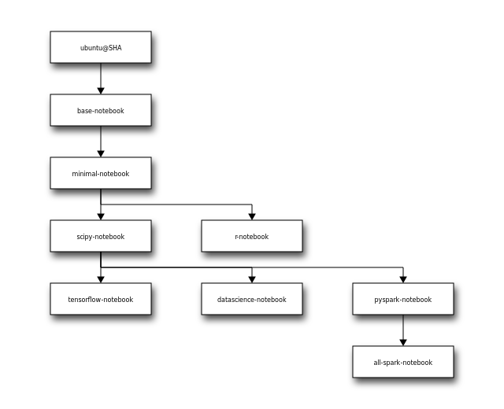
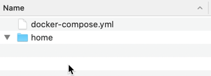

# Run Junyper Notebook on Docker

Running Junyper Notebook locally can be cool, however I don't like to install stuff, that later I need to update or if I uninstall something, how do I know the thing didn't leave any file there or config to remove, plus not to mention that I don't want to deal with local configs.

**Bottom line** I like to keep my local machine as vanilla as possible, with minimum setups.

**Solution** DOCKER!

## Steps
To run Junyper on Docker, you can follow these steps:
1. Install Docker Desktop
1. Choose the Image you want to use
1. Create a docker compose file
1. Run it

## Docker Desktop
[Docker Desktop Site](https://www.docker.com/products/docker-desktop)

## Image
To use Junyper as a Docker image, is quite simple, the hardest thing is to pick the Image you want to use:

* jupyter/base-notebook
* jupyter/minimal-notebook
* jupyter/r-notebook
* jupyter/scipy-notebook
* jupyter/tensorflow-notebook
* jupyter/datascience-notebook
* jupyter/datascience-notebook
* jupyter/pyspark-notebook
* jupyter/all-spark-notebook
* jupyter/all-spark-notebook

For more info: https://jupyter-docker-stacks.readthedocs.io/en/latest/using/selecting.html#core-stacks

This diagram makes it easy to understand:


**For the sake of this demo, I will pick `jupyter/scipy-notebook`**

## Docker File
Save the following in a clean directory, where you will save your projects:
```
version: "3.9"

services:
  junyper:
    image: jupyter/scipy-notebook:latest
    container_name: jupyter
    restart: unless-stopped
    ports:
      - "8888:8888"
    networks:
      - junyper-local
    volumes:
      - ./home:/home/jovyan

networks:
  junyper-local:
    driver: bridge

```

Once saved, **create** a new directory called: `home`



## Run it!

At the command line run:

```
docker-compose up -d
```

## Tips & Other Commands

[Compose command-line reference](https://docs.docker.com/compose/reference/)

### How to see the token?
```
docker-compose logs junyper |grep '127.0.0.1:8888' |grep 'token' |head -1
```

Or list all the logs:
```
docker-compose logs junyper
```


### Stop the container
```
docker-compose stop
```

### Remove container completly
```
docker-compose stop
docker-compose rm -f
```
### List running containers

**List running compose projects**
```
docker-compose ls
```
**List Containers**
```
docker-compose ps
```
