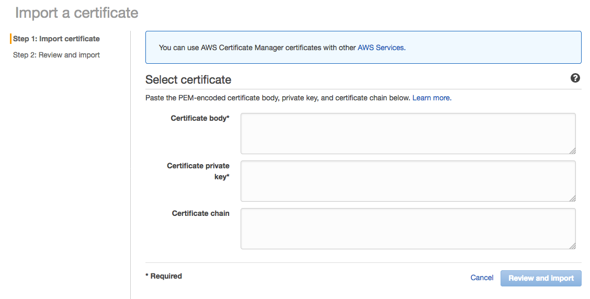
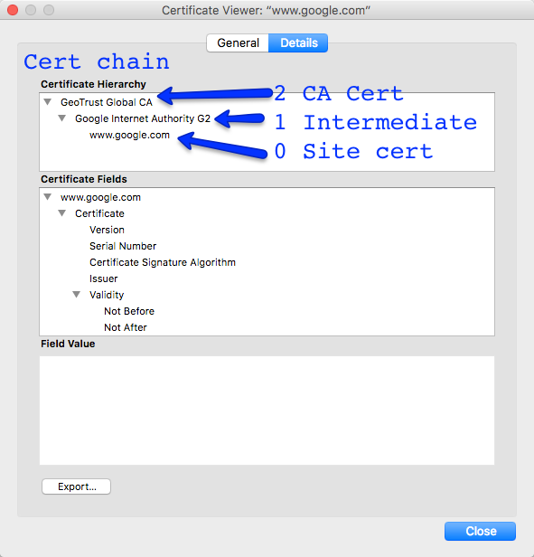

# AWS Certificate Manager without Certificate Chain

## Issue

While working on a project, it was required to import a SSL certificate into the Amazon Certificate Manager, however we were given only the Certificate and the private key, not the **certificate chain**

While it works fine for an Apache server, it does not for AWS Certicate Manager.



## Problem

Asking for the certificate chain to the guys who initially provided the certificate in the first place.

While this is the most logical option, it was not possible at this time, mostly because any request to them takes forever and the setup had to be done as soon as possible.

## SSL/HTTPS Context

SSL communications basically uses a key exchange between the server and the client, the reason why you need a certificate chain, it's because the client; which in a normal case is the browser, validates the certificate:

1. Server certificate has not expired
2. The server certificate was issued to the actual URL
3. The certificate can be verified against the company who issue the certificate in the first place

So this is what the certificate chain is used for, which means that, the server will return the certificate chain in the response so the browser can validate the certicate.

**And that's exactly what I'm looking for**

## Solution : Get the certificate chain from the remote site

The domain I was trying to setup, was a third level domain, which looks like this: *mysubdomain.domain.com* 

So I had access to **domain.com**

## Review the remote site certificate chain

For the sake of the exercise, I'm going to use Google.

**Review the certificate chain**

* Certificate 0 : Server certificate.
* Certificate 1 : Intermediate certificate
* Certificate 2 : CA Root certificate


 
```
> openssl s_client -servername google.com -connect google.com:443


CONNECTED(00000009)
depth=2 /C=US/O=GeoTrust Inc./CN=GeoTrust Global CA
verify error:num=20:unable to get local issuer certificate
verify return:0
---
Certificate chain
 0 s:/C=US/ST=California/L=Mountain View/O=Google Inc/CN=*.google.com
   i:/C=US/O=Google Inc/CN=Google Internet Authority G2
 1 s:/C=US/O=Google Inc/CN=Google Internet Authority G2
   i:/C=US/O=GeoTrust Inc./CN=GeoTrust Global CA
 2 s:/C=US/O=GeoTrust Inc./CN=GeoTrust Global CA
   i:/C=US/O=Equifax/OU=Equifax Secure Certificate Authority
---
Server certificate
-----BEGIN CERTIFICATE-----
MIIIPjCCByagAwIBAgIIPR3kTjRuzmgwDQYJKoZIhvcNAQELBQAwSTELMAkGA1UE
BhMCVVMxEzARBgNVBAoTCkdvb2dsZSBJbmMxJTAjBgNVBAMTHEdvb2dsZSBJbnRl
cm5ldCBBdXRob3JpdHkgRzIwHhcNMTcxMTAxMTM0ODU2WhcNMTgwMTI0MTMzMTAw
WjBmMQswCQYDVQQGEwJVUzETMBEGA1UECAwKQ2FsaWZvcm5pYTEWMBQGA1UEBwwN
TW91bnRhaW4gVmlldzETMBEGA1UECgwKR29vZ2xlIEluYzEVMBMGA1UEAwwMKi5n
b29nbGUuY29tMIIBIjANBgkqhkiG9w0BAQEFAAOCAQ8AMIIBCgKCAQEArB7gUfrQ
317Dpod3k7cwq/j7lNZsBD+YPVr29seRUotrIDn9PR1IzFFyA2YtiOZVRJIMf9FU
lzYtsZng+HJv48eqGQI2e2eRnnZf2Eq5ORTzyWkx06KjRsYInsq3ZrEe5yj+dhgl
SfDbs1wwJ1Yxea1i7JsiXUJp1wIuSw9mVJZzaQpN6YT30aD1KSBMFgORXXYKq0Z4
W0qlbeIhVDs8fTuBzQeVaxLKDKZoEDweWHYwx34OCVj7hi8R0+keJ44259xrR6Sg
63Yy5T4Z4morTRuIxlfJM8WVKeEJbWjyCTekV0rvuBC2fsjCEXzHmiJrAQj8EYLQ
JEHr23uzaqbYXQIDAQABo4IFCzCCBQcwEwYDVR0lBAwwCgYIKwYBBQUHAwEwggPh
BgNVHREEggPYMIID1IIMKi5nb29nbGUuY29tgg0qLmFuZHJvaWQuY29tghYqLmFw
cGVuZ2luZS5nb29nbGUuY29tghIqLmNsb3VkLmdvb2dsZS5jb22CFCouZGI4MzM5
NTMuZ29vZ2xlLmNuggYqLmcuY2+CDiouZ2NwLmd2dDIuY29tghYqLmdvb2dsZS1h
bmFseXRpY3MuY29tggsqLmdvb2dsZS5jYYILKi5nb29nbGUuY2yCDiouZ29vZ2xl
LmNvLmlugg4qLmdvb2dsZS5jby5qcIIOKi5nb29nbGUuY28udWuCDyouZ29vZ2xl
LmNvbS5hcoIPKi5nb29nbGUuY29tLmF1gg8qLmdvb2dsZS5jb20uYnKCDyouZ29v
Z2xlLmNvbS5jb4IPKi5nb29nbGUuY29tLm14gg8qLmdvb2dsZS5jb20udHKCDyou
Z29vZ2xlLmNvbS52boILKi5nb29nbGUuZGWCCyouZ29vZ2xlLmVzggsqLmdvb2ds
ZS5mcoILKi5nb29nbGUuaHWCCyouZ29vZ2xlLml0ggsqLmdvb2dsZS5ubIILKi5n
b29nbGUucGyCCyouZ29vZ2xlLnB0ghIqLmdvb2dsZWFkYXBpcy5jb22CDyouZ29v
Z2xlYXBpcy5jboIUKi5nb29nbGVjb21tZXJjZS5jb22CESouZ29vZ2xldmlkZW8u
Y29tggwqLmdzdGF0aWMuY26CDSouZ3N0YXRpYy5jb22CCiouZ3Z0MS5jb22CCiou
Z3Z0Mi5jb22CFCoubWV0cmljLmdzdGF0aWMuY29tggwqLnVyY2hpbi5jb22CECou
dXJsLmdvb2dsZS5jb22CFioueW91dHViZS1ub2Nvb2tpZS5jb22CDSoueW91dHVi
ZS5jb22CFioueW91dHViZWVkdWNhdGlvbi5jb22CByoueXQuYmWCCyoueXRpbWcu
Y29tghphbmRyb2lkLmNsaWVudHMuZ29vZ2xlLmNvbYILYW5kcm9pZC5jb22CG2Rl
dmVsb3Blci5hbmRyb2lkLmdvb2dsZS5jboIcZGV2ZWxvcGVycy5hbmRyb2lkLmdv
b2dsZS5jboIEZy5jb4IGZ29vLmdsghRnb29nbGUtYW5hbHl0aWNzLmNvbYIKZ29v
Z2xlLmNvbYISZ29vZ2xlY29tbWVyY2UuY29tghhzb3VyY2UuYW5kcm9pZC5nb29n
bGUuY26CCnVyY2hpbi5jb22CCnd3dy5nb28uZ2yCCHlvdXR1LmJlggt5b3V0dWJl
LmNvbYIUeW91dHViZWVkdWNhdGlvbi5jb22CBXl0LmJlMGgGCCsGAQUFBwEBBFww
WjArBggrBgEFBQcwAoYfaHR0cDovL3BraS5nb29nbGUuY29tL0dJQUcyLmNydDAr
BggrBgEFBQcwAYYfaHR0cDovL2NsaWVudHMxLmdvb2dsZS5jb20vb2NzcDAdBgNV
HQ4EFgQUsbgPE1pb/BmfNpF5Q+t2JkU1JHEwDAYDVR0TAQH/BAIwADAfBgNVHSME
GDAWgBRK3QYWG7z2aLV29YG2u2IaulqBLzAhBgNVHSAEGjAYMAwGCisGAQQB1nkC
BQEwCAYGZ4EMAQICMDAGA1UdHwQpMCcwJaAjoCGGH2h0dHA6Ly9wa2kuZ29vZ2xl
LmNvbS9HSUFHMi5jcmwwDQYJKoZIhvcNAQELBQADggEBAHYq722AH3tp2ORNJYz0
tAV0p8r16tDEs4Pm/pVNVMu3UQpI31q8UNEs2VglSlDlExBOrczY30+FLkRE9K4/
yv1ELw9LJtHChwSxzAggccK4UQIvxbqTMZsoXhsoo0YDEOrr2jzmVNbtljicKn5c
7RTYhHKTTU+VUjznEu3K6T3QocvJaXBywX08UA/NIqQOLfKhFpeSgLnVKYq9P/b9
9T11DxOutCwLXrwWYbCIAMuVHUMYEeaBtyhLII3Vr03pY2tjT9BFcyRdU1uMLbuM
VRyCr/KpNJVlBwLC1nrhHK065ctsJXkbRmZ5jaDVQA/BuxGlq9MA4ikcqocPPZ48
0i0=
-----END CERTIFICATE-----
subject=/C=US/ST=California/L=Mountain View/O=Google Inc/CN=*.google.com
issuer=/C=US/O=Google Inc/CN=Google Internet Authority G2
---
No client certificate CA names sent
---
SSL handshake has read 4449 bytes and written 442 bytes
---
New, TLSv1/SSLv3, Cipher is AES128-SHA
Server public key is 2048 bit
Secure Renegotiation IS supported
Compression: NONE
Expansion: NONE
SSL-Session:
    Protocol  : TLSv1
    Cipher    : AES128-SHA
    Session-ID: CEC8A85932087DBBE956A6440768A51320E9A4B2754100AE2F28070CF0518D12
    Session-ID-ctx: 
    Master-Key: E4DBB943F66E6DB2F7B8BCA88DD8ECA99354B18F72B02EED1844967B366C87D9FF6DE691F4D8133566B3E02DCF20D5BD
    Key-Arg   : None
    TLS session ticket lifetime hint: 100800 (seconds)
    TLS session ticket:
    0000 - 00 d9 5f df af 9f 56 cb-4f e9 15 54 7d 9f f1 3e   .._...V.O..T}..>
    0010 - 80 2b 33 8f 59 33 8f 9b-07 43 d4 bf ea 50 fb 2a   .+3.Y3...C...P.*
    0020 - 5c 01 8a ca 0d 93 b9 20-9b 0f 90 81 1b 30 a3 1c   \...... .....0..
    0030 - 6f fd e4 c8 17 d8 26 f4-91 82 41 03 85 a0 f1 ee   o.....&...A.....
    0040 - 8e 76 36 6c 66 16 76 1a-f9 86 e5 24 98 5b 49 69   .v6lf.v....$.[Ii
    0050 - 89 d0 58 1d 65 15 dd 43-68 28 45 6d 4d 02 e3 6d   ..X.e..Ch(EmM..m
    0060 - 39 6a 3a c6 e1 52 43 8f-ba bb 55 0a 4e 37 22 8c   9j:..RC...U.N7".
    0070 - 32 ee b2 d2 eb 50 b0 da-85 b5 d4 33 0c e9 5d 2c   2....P.....3..],
    0080 - 22 93 fa 49 84 f2 ea 65-f1 9c 16 7f 76 9a fa dc   "..I...e....v...
    0090 - 18 f1 e4 e9 37 ba ec be-94 d0 d4 c9 2f 20 b2 83   ....7......./ ..
    00a0 - 16 ee 7e 3e 3a 98 1c 0e-9a bd e9 72 d1 28 5d eb   ..~>:......r.(].
    00b0 - 62 fc be 08 84 ad 04 9d-64 e7 93 1c 91 b4 5c b0   b.......d.....\.
    00c0 - 53 20 2f 7e 21 65 7a 11-01 db 22 15 fd a7 79 79   S /~!ez..."...yy

    Start Time: 1511915667
    Timeout   : 300 (sec)
    Verify return code: 0 (ok)

```

In this case we only need the intermediate certificate, the CA certificate is not required because browsers already have it and it's a waste of network traffic.


## Get the remote chain certificate

```
> openssl s_client -showcerts -connect google.com:443

CONNECTED(00000009)
---
Certificate chain
 0 s:/C=US/ST=California/L=Mountain View/O=Google Inc/CN=*.google.com
   i:/C=US/O=Google Inc/CN=Google Internet Authority G2
-----BEGIN CERTIFICATE-----
MIIIPjCCByagAwIBAgIIPR3kTjRuzmgwDQYJKoZIhvcNAQELBQAwSTELMAkGA1UE
BhMCVVMxEzARBgNVBAoTCkdvb2dsZSBJbmMxJTAjBgNVBAMTHEdvb2dsZSBJbnRl
cm5ldCBBdXRob3JpdHkgRzIwHhcNMTcxMTAxMTM0ODU2WhcNMTgwMTI0MTMzMTAw
WjBmMQswCQYDVQQGEwJVUzETMBEGA1UECAwKQ2FsaWZvcm5pYTEWMBQGA1UEBwwN
TW91bnRhaW4gVmlldzETMBEGA1UECgwKR29vZ2xlIEluYzEVMBMGA1UEAwwMKi5n
b29nbGUuY29tMIIBIjANBgkqhkiG9w0BAQEFAAOCAQ8AMIIBCgKCAQEArB7gUfrQ
317Dpod3k7cwq/j7lNZsBD+YPVr29seRUotrIDn9PR1IzFFyA2YtiOZVRJIMf9FU
lzYtsZng+HJv48eqGQI2e2eRnnZf2Eq5ORTzyWkx06KjRsYInsq3ZrEe5yj+dhgl
SfDbs1wwJ1Yxea1i7JsiXUJp1wIuSw9mVJZzaQpN6YT30aD1KSBMFgORXXYKq0Z4
W0qlbeIhVDs8fTuBzQeVaxLKDKZoEDweWHYwx34OCVj7hi8R0+keJ44259xrR6Sg
63Yy5T4Z4morTRuIxlfJM8WVKeEJbWjyCTekV0rvuBC2fsjCEXzHmiJrAQj8EYLQ
JEHr23uzaqbYXQIDAQABo4IFCzCCBQcwEwYDVR0lBAwwCgYIKwYBBQUHAwEwggPh
BgNVHREEggPYMIID1IIMKi5nb29nbGUuY29tgg0qLmFuZHJvaWQuY29tghYqLmFw
cGVuZ2luZS5nb29nbGUuY29tghIqLmNsb3VkLmdvb2dsZS5jb22CFCouZGI4MzM5
NTMuZ29vZ2xlLmNuggYqLmcuY2+CDiouZ2NwLmd2dDIuY29tghYqLmdvb2dsZS1h
bmFseXRpY3MuY29tggsqLmdvb2dsZS5jYYILKi5nb29nbGUuY2yCDiouZ29vZ2xl
LmNvLmlugg4qLmdvb2dsZS5jby5qcIIOKi5nb29nbGUuY28udWuCDyouZ29vZ2xl
LmNvbS5hcoIPKi5nb29nbGUuY29tLmF1gg8qLmdvb2dsZS5jb20uYnKCDyouZ29v
Z2xlLmNvbS5jb4IPKi5nb29nbGUuY29tLm14gg8qLmdvb2dsZS5jb20udHKCDyou
Z29vZ2xlLmNvbS52boILKi5nb29nbGUuZGWCCyouZ29vZ2xlLmVzggsqLmdvb2ds
ZS5mcoILKi5nb29nbGUuaHWCCyouZ29vZ2xlLml0ggsqLmdvb2dsZS5ubIILKi5n
b29nbGUucGyCCyouZ29vZ2xlLnB0ghIqLmdvb2dsZWFkYXBpcy5jb22CDyouZ29v
Z2xlYXBpcy5jboIUKi5nb29nbGVjb21tZXJjZS5jb22CESouZ29vZ2xldmlkZW8u
Y29tggwqLmdzdGF0aWMuY26CDSouZ3N0YXRpYy5jb22CCiouZ3Z0MS5jb22CCiou
Z3Z0Mi5jb22CFCoubWV0cmljLmdzdGF0aWMuY29tggwqLnVyY2hpbi5jb22CECou
dXJsLmdvb2dsZS5jb22CFioueW91dHViZS1ub2Nvb2tpZS5jb22CDSoueW91dHVi
ZS5jb22CFioueW91dHViZWVkdWNhdGlvbi5jb22CByoueXQuYmWCCyoueXRpbWcu
Y29tghphbmRyb2lkLmNsaWVudHMuZ29vZ2xlLmNvbYILYW5kcm9pZC5jb22CG2Rl
dmVsb3Blci5hbmRyb2lkLmdvb2dsZS5jboIcZGV2ZWxvcGVycy5hbmRyb2lkLmdv
b2dsZS5jboIEZy5jb4IGZ29vLmdsghRnb29nbGUtYW5hbHl0aWNzLmNvbYIKZ29v
Z2xlLmNvbYISZ29vZ2xlY29tbWVyY2UuY29tghhzb3VyY2UuYW5kcm9pZC5nb29n
bGUuY26CCnVyY2hpbi5jb22CCnd3dy5nb28uZ2yCCHlvdXR1LmJlggt5b3V0dWJl
LmNvbYIUeW91dHViZWVkdWNhdGlvbi5jb22CBXl0LmJlMGgGCCsGAQUFBwEBBFww
WjArBggrBgEFBQcwAoYfaHR0cDovL3BraS5nb29nbGUuY29tL0dJQUcyLmNydDAr
BggrBgEFBQcwAYYfaHR0cDovL2NsaWVudHMxLmdvb2dsZS5jb20vb2NzcDAdBgNV
HQ4EFgQUsbgPE1pb/BmfNpF5Q+t2JkU1JHEwDAYDVR0TAQH/BAIwADAfBgNVHSME
GDAWgBRK3QYWG7z2aLV29YG2u2IaulqBLzAhBgNVHSAEGjAYMAwGCisGAQQB1nkC
BQEwCAYGZ4EMAQICMDAGA1UdHwQpMCcwJaAjoCGGH2h0dHA6Ly9wa2kuZ29vZ2xl
LmNvbS9HSUFHMi5jcmwwDQYJKoZIhvcNAQELBQADggEBAHYq722AH3tp2ORNJYz0
tAV0p8r16tDEs4Pm/pVNVMu3UQpI31q8UNEs2VglSlDlExBOrczY30+FLkRE9K4/
yv1ELw9LJtHChwSxzAggccK4UQIvxbqTMZsoXhsoo0YDEOrr2jzmVNbtljicKn5c
7RTYhHKTTU+VUjznEu3K6T3QocvJaXBywX08UA/NIqQOLfKhFpeSgLnVKYq9P/b9
9T11DxOutCwLXrwWYbCIAMuVHUMYEeaBtyhLII3Vr03pY2tjT9BFcyRdU1uMLbuM
VRyCr/KpNJVlBwLC1nrhHK065ctsJXkbRmZ5jaDVQA/BuxGlq9MA4ikcqocPPZ48
0i0=
-----END CERTIFICATE-----
 1 s:/C=US/O=Google Inc/CN=Google Internet Authority G2
   i:/C=US/O=GeoTrust Inc./CN=GeoTrust Global CA
-----BEGIN CERTIFICATE-----
MIIEKDCCAxCgAwIBAgIQAQAhJYiw+lmnd+8Fe2Yn3zANBgkqhkiG9w0BAQsFADBC
MQswCQYDVQQGEwJVUzEWMBQGA1UEChMNR2VvVHJ1c3QgSW5jLjEbMBkGA1UEAxMS
R2VvVHJ1c3QgR2xvYmFsIENBMB4XDTE3MDUyMjExMzIzN1oXDTE4MTIzMTIzNTk1
OVowSTELMAkGA1UEBhMCVVMxEzARBgNVBAoTCkdvb2dsZSBJbmMxJTAjBgNVBAMT
HEdvb2dsZSBJbnRlcm5ldCBBdXRob3JpdHkgRzIwggEiMA0GCSqGSIb3DQEBAQUA
A4IBDwAwggEKAoIBAQCcKgR3XNhQkToGo4Lg2FBIvIk/8RlwGohGfuCPxfGJziHu
Wv5hDbcyRImgdAtTT1WkzoJile7rWV/G4QWAEsRelD+8W0g49FP3JOb7kekVxM/0
Uw30SvyfVN59vqBrb4fA0FAfKDADQNoIc1Fsf/86PKc3Bo69SxEE630k3ub5/DFx
+5TVYPMuSq9C0svqxGoassxT3RVLix/IGWEfzZ2oPmMrhDVpZYTIGcVGIvhTlb7j
gEoQxirsupcgEcc5mRAEoPBhepUljE5SdeK27QjKFPzOImqzTs9GA5eXA37Asd57
r0Uzz7o+cbfe9CUlwg01iZ2d+w4ReYkeN8WvjnJpAgMBAAGjggERMIIBDTAfBgNV
HSMEGDAWgBTAephojYn7qwVkDBF9qn1luMrMTjAdBgNVHQ4EFgQUSt0GFhu89mi1
dvWBtrtiGrpagS8wDgYDVR0PAQH/BAQDAgEGMC4GCCsGAQUFBwEBBCIwIDAeBggr
BgEFBQcwAYYSaHR0cDovL2cuc3ltY2QuY29tMBIGA1UdEwEB/wQIMAYBAf8CAQAw
NQYDVR0fBC4wLDAqoCigJoYkaHR0cDovL2cuc3ltY2IuY29tL2NybHMvZ3RnbG9i
YWwuY3JsMCEGA1UdIAQaMBgwDAYKKwYBBAHWeQIFATAIBgZngQwBAgIwHQYDVR0l
BBYwFAYIKwYBBQUHAwEGCCsGAQUFBwMCMA0GCSqGSIb3DQEBCwUAA4IBAQDKSeWs
12Rkd1u+cfrP9B4jx5ppY1Rf60zWGSgjZGaOHMeHgGRfBIsmr5jfCnC8vBk97nsz
qX+99AXUcLsFJnnqmseYuQcZZTTMPOk/xQH6bwx+23pwXEz+LQDwyr4tjrSogPsB
E4jLnD/lu3fKOmc2887VJwJyQ6C9bgLxRwVxPgFZ6RGeGvOED4Cmong1L7bHon8X
fOGLVq7uZ4hRJzBgpWJSwzfVO+qFKgE4h6LPcK2kesnE58rF2rwjMvL+GMJ74N87
L9TQEOaWTPtEtyFkDbkAlDASJodYmDkFOA/MgkgMCkdm7r+0X8T/cKjhf4t5K7hl
MqO5tzHpCvX2HzLc
-----END CERTIFICATE-----
 2 s:/C=US/O=GeoTrust Inc./CN=GeoTrust Global CA
   i:/C=US/O=Equifax/OU=Equifax Secure Certificate Authority
-----BEGIN CERTIFICATE-----
MIIDfTCCAuagAwIBAgIDErvmMA0GCSqGSIb3DQEBBQUAME4xCzAJBgNVBAYTAlVT
MRAwDgYDVQQKEwdFcXVpZmF4MS0wKwYDVQQLEyRFcXVpZmF4IFNlY3VyZSBDZXJ0
aWZpY2F0ZSBBdXRob3JpdHkwHhcNMDIwNTIxMDQwMDAwWhcNMTgwODIxMDQwMDAw
WjBCMQswCQYDVQQGEwJVUzEWMBQGA1UEChMNR2VvVHJ1c3QgSW5jLjEbMBkGA1UE
AxMSR2VvVHJ1c3QgR2xvYmFsIENBMIIBIjANBgkqhkiG9w0BAQEFAAOCAQ8AMIIB
CgKCAQEA2swYYzD99BcjGlZ+W988bDjkcbd4kdS8odhM+KhDtgPpTSEHCIjaWC9m
OSm9BXiLnTjoBbdqfnGk5sRgprDvgOSJKA+eJdbtg/OtppHHmMlCGDUUna2YRpIu
T8rxh0PBFpVXLVDviS2Aelet8u5fa9IAjbkU+BQVNdnARqN7csiRv8lVK83Qlz6c
JmTM386DGXHKTubU1XupGc1V3sjs0l44U+VcT4wt/lAjNvxm5suOpDkZALeVAjmR
Cw7+OC7RHQWa9k0+bw8HHa8sHo9gOeL6NlMTOdReJivbPagUvTLrGAMoUgRx5asz
PeE4uwc2hGKceeoWMPRfwCvocWvk+QIDAQABo4HwMIHtMB8GA1UdIwQYMBaAFEjm
aPkr0rKV10fYIyAQTzOYkJ/UMB0GA1UdDgQWBBTAephojYn7qwVkDBF9qn1luMrM
TjAPBgNVHRMBAf8EBTADAQH/MA4GA1UdDwEB/wQEAwIBBjA6BgNVHR8EMzAxMC+g
LaArhilodHRwOi8vY3JsLmdlb3RydXN0LmNvbS9jcmxzL3NlY3VyZWNhLmNybDBO
BgNVHSAERzBFMEMGBFUdIAAwOzA5BggrBgEFBQcCARYtaHR0cHM6Ly93d3cuZ2Vv
dHJ1c3QuY29tL3Jlc291cmNlcy9yZXBvc2l0b3J5MA0GCSqGSIb3DQEBBQUAA4GB
AHbhEm5OSxYShjAGsoEIz/AIx8dxfmbuwu3UOx//8PDITtZDOLC5MH0Y0FWDomrL
NhGc6Ehmo21/uBPUR/6LWlxz/K7ZGzIZOKuXNBSqltLroxwUCEm2u+WR74M26x1W
b8ravHNjkOR/ez4iyz0H7V84dJzjA1BOoa+Y7mHyhD8S
-----END CERTIFICATE-----
---
Server certificate
subject=/C=US/ST=California/L=Mountain View/O=Google Inc/CN=*.google.com
issuer=/C=US/O=Google Inc/CN=Google Internet Authority G2
---
No client certificate CA names sent
---
SSL handshake has read 4254 bytes and written 456 bytes
---
New, TLSv1/SSLv3, Cipher is AES128-SHA
Server public key is 2048 bit
Secure Renegotiation IS supported
Compression: NONE
Expansion: NONE
SSL-Session:
    Protocol  : TLSv1
    Cipher    : AES128-SHA
    Session-ID: A4CB7F1AA095D6337462BA9F2B9A01A44F9DB918997D0FFAA3EB2EB6518A8442
    Session-ID-ctx: 
    Master-Key: 29D55A0D94D1C597D2B167EE9923A4B163D6BFB9359D48BBCACB84685BC56CC666A90426257205BB535AFE1B863DC139
    Key-Arg   : None
    Start Time: 1511915307
    Timeout   : 300 (sec)
    Verify return code: 0 (ok)
---

```

**Quick and dirty version** copy and paste the intermediate certificate into a new file called: `certchain.crt` and you're done!

**certchain.crt**
```
-----BEGIN CERTIFICATE-----
MIIEKDCCAxCgAwIBAgIQAQAhJYiw+lmnd+8Fe2Yn3zANBgkqhkiG9w0BAQsFADBC
MQswCQYDVQQGEwJVUzEWMBQGA1UEChMNR2VvVHJ1c3QgSW5jLjEbMBkGA1UEAxMS
R2VvVHJ1c3QgR2xvYmFsIENBMB4XDTE3MDUyMjExMzIzN1oXDTE4MTIzMTIzNTk1
OVowSTELMAkGA1UEBhMCVVMxEzARBgNVBAoTCkdvb2dsZSBJbmMxJTAjBgNVBAMT
HEdvb2dsZSBJbnRlcm5ldCBBdXRob3JpdHkgRzIwggEiMA0GCSqGSIb3DQEBAQUA
A4IBDwAwggEKAoIBAQCcKgR3XNhQkToGo4Lg2FBIvIk/8RlwGohGfuCPxfGJziHu
Wv5hDbcyRImgdAtTT1WkzoJile7rWV/G4QWAEsRelD+8W0g49FP3JOb7kekVxM/0
Uw30SvyfVN59vqBrb4fA0FAfKDADQNoIc1Fsf/86PKc3Bo69SxEE630k3ub5/DFx
+5TVYPMuSq9C0svqxGoassxT3RVLix/IGWEfzZ2oPmMrhDVpZYTIGcVGIvhTlb7j
gEoQxirsupcgEcc5mRAEoPBhepUljE5SdeK27QjKFPzOImqzTs9GA5eXA37Asd57
r0Uzz7o+cbfe9CUlwg01iZ2d+w4ReYkeN8WvjnJpAgMBAAGjggERMIIBDTAfBgNV
HSMEGDAWgBTAephojYn7qwVkDBF9qn1luMrMTjAdBgNVHQ4EFgQUSt0GFhu89mi1
dvWBtrtiGrpagS8wDgYDVR0PAQH/BAQDAgEGMC4GCCsGAQUFBwEBBCIwIDAeBggr
BgEFBQcwAYYSaHR0cDovL2cuc3ltY2QuY29tMBIGA1UdEwEB/wQIMAYBAf8CAQAw
NQYDVR0fBC4wLDAqoCigJoYkaHR0cDovL2cuc3ltY2IuY29tL2NybHMvZ3RnbG9i
YWwuY3JsMCEGA1UdIAQaMBgwDAYKKwYBBAHWeQIFATAIBgZngQwBAgIwHQYDVR0l
BBYwFAYIKwYBBQUHAwEGCCsGAQUFBwMCMA0GCSqGSIb3DQEBCwUAA4IBAQDKSeWs
12Rkd1u+cfrP9B4jx5ppY1Rf60zWGSgjZGaOHMeHgGRfBIsmr5jfCnC8vBk97nsz
qX+99AXUcLsFJnnqmseYuQcZZTTMPOk/xQH6bwx+23pwXEz+LQDwyr4tjrSogPsB
E4jLnD/lu3fKOmc2887VJwJyQ6C9bgLxRwVxPgFZ6RGeGvOED4Cmong1L7bHon8X
fOGLVq7uZ4hRJzBgpWJSwzfVO+qFKgE4h6LPcK2kesnE58rF2rwjMvL+GMJ74N87
L9TQEOaWTPtEtyFkDbkAlDASJodYmDkFOA/MgkgMCkdm7r+0X8T/cKjhf4t5K7hl
MqO5tzHpCvX2HzLc
-----END CERTIFICATE-----
```

### Include the full chain with the CA

You can use this other version (which is valid) if you want to include the full chain, that's the intermediate certificate and the root CA certificate.

**certchain_with_ca.crt**
```
-----BEGIN CERTIFICATE-----
MIIEKDCCAxCgAwIBAgIQAQAhJYiw+lmnd+8Fe2Yn3zANBgkqhkiG9w0BAQsFADBC
MQswCQYDVQQGEwJVUzEWMBQGA1UEChMNR2VvVHJ1c3QgSW5jLjEbMBkGA1UEAxMS
R2VvVHJ1c3QgR2xvYmFsIENBMB4XDTE3MDUyMjExMzIzN1oXDTE4MTIzMTIzNTk1
OVowSTELMAkGA1UEBhMCVVMxEzARBgNVBAoTCkdvb2dsZSBJbmMxJTAjBgNVBAMT
HEdvb2dsZSBJbnRlcm5ldCBBdXRob3JpdHkgRzIwggEiMA0GCSqGSIb3DQEBAQUA
A4IBDwAwggEKAoIBAQCcKgR3XNhQkToGo4Lg2FBIvIk/8RlwGohGfuCPxfGJziHu
Wv5hDbcyRImgdAtTT1WkzoJile7rWV/G4QWAEsRelD+8W0g49FP3JOb7kekVxM/0
Uw30SvyfVN59vqBrb4fA0FAfKDADQNoIc1Fsf/86PKc3Bo69SxEE630k3ub5/DFx
+5TVYPMuSq9C0svqxGoassxT3RVLix/IGWEfzZ2oPmMrhDVpZYTIGcVGIvhTlb7j
gEoQxirsupcgEcc5mRAEoPBhepUljE5SdeK27QjKFPzOImqzTs9GA5eXA37Asd57
r0Uzz7o+cbfe9CUlwg01iZ2d+w4ReYkeN8WvjnJpAgMBAAGjggERMIIBDTAfBgNV
HSMEGDAWgBTAephojYn7qwVkDBF9qn1luMrMTjAdBgNVHQ4EFgQUSt0GFhu89mi1
dvWBtrtiGrpagS8wDgYDVR0PAQH/BAQDAgEGMC4GCCsGAQUFBwEBBCIwIDAeBggr
BgEFBQcwAYYSaHR0cDovL2cuc3ltY2QuY29tMBIGA1UdEwEB/wQIMAYBAf8CAQAw
NQYDVR0fBC4wLDAqoCigJoYkaHR0cDovL2cuc3ltY2IuY29tL2NybHMvZ3RnbG9i
YWwuY3JsMCEGA1UdIAQaMBgwDAYKKwYBBAHWeQIFATAIBgZngQwBAgIwHQYDVR0l
BBYwFAYIKwYBBQUHAwEGCCsGAQUFBwMCMA0GCSqGSIb3DQEBCwUAA4IBAQDKSeWs
12Rkd1u+cfrP9B4jx5ppY1Rf60zWGSgjZGaOHMeHgGRfBIsmr5jfCnC8vBk97nsz
qX+99AXUcLsFJnnqmseYuQcZZTTMPOk/xQH6bwx+23pwXEz+LQDwyr4tjrSogPsB
E4jLnD/lu3fKOmc2887VJwJyQ6C9bgLxRwVxPgFZ6RGeGvOED4Cmong1L7bHon8X
fOGLVq7uZ4hRJzBgpWJSwzfVO+qFKgE4h6LPcK2kesnE58rF2rwjMvL+GMJ74N87
L9TQEOaWTPtEtyFkDbkAlDASJodYmDkFOA/MgkgMCkdm7r+0X8T/cKjhf4t5K7hl
MqO5tzHpCvX2HzLc
-----END CERTIFICATE-----
-----BEGIN CERTIFICATE-----
MIIDfTCCAuagAwIBAgIDErvmMA0GCSqGSIb3DQEBBQUAME4xCzAJBgNVBAYTAlVT
MRAwDgYDVQQKEwdFcXVpZmF4MS0wKwYDVQQLEyRFcXVpZmF4IFNlY3VyZSBDZXJ0
aWZpY2F0ZSBBdXRob3JpdHkwHhcNMDIwNTIxMDQwMDAwWhcNMTgwODIxMDQwMDAw
WjBCMQswCQYDVQQGEwJVUzEWMBQGA1UEChMNR2VvVHJ1c3QgSW5jLjEbMBkGA1UE
AxMSR2VvVHJ1c3QgR2xvYmFsIENBMIIBIjANBgkqhkiG9w0BAQEFAAOCAQ8AMIIB
CgKCAQEA2swYYzD99BcjGlZ+W988bDjkcbd4kdS8odhM+KhDtgPpTSEHCIjaWC9m
OSm9BXiLnTjoBbdqfnGk5sRgprDvgOSJKA+eJdbtg/OtppHHmMlCGDUUna2YRpIu
T8rxh0PBFpVXLVDviS2Aelet8u5fa9IAjbkU+BQVNdnARqN7csiRv8lVK83Qlz6c
JmTM386DGXHKTubU1XupGc1V3sjs0l44U+VcT4wt/lAjNvxm5suOpDkZALeVAjmR
Cw7+OC7RHQWa9k0+bw8HHa8sHo9gOeL6NlMTOdReJivbPagUvTLrGAMoUgRx5asz
PeE4uwc2hGKceeoWMPRfwCvocWvk+QIDAQABo4HwMIHtMB8GA1UdIwQYMBaAFEjm
aPkr0rKV10fYIyAQTzOYkJ/UMB0GA1UdDgQWBBTAephojYn7qwVkDBF9qn1luMrM
TjAPBgNVHRMBAf8EBTADAQH/MA4GA1UdDwEB/wQEAwIBBjA6BgNVHR8EMzAxMC+g
LaArhilodHRwOi8vY3JsLmdlb3RydXN0LmNvbS9jcmxzL3NlY3VyZWNhLmNybDBO
BgNVHSAERzBFMEMGBFUdIAAwOzA5BggrBgEFBQcCARYtaHR0cHM6Ly93d3cuZ2Vv
dHJ1c3QuY29tL3Jlc291cmNlcy9yZXBvc2l0b3J5MA0GCSqGSIb3DQEBBQUAA4GB
AHbhEm5OSxYShjAGsoEIz/AIx8dxfmbuwu3UOx//8PDITtZDOLC5MH0Y0FWDomrL
NhGc6Ehmo21/uBPUR/6LWlxz/K7ZGzIZOKuXNBSqltLroxwUCEm2u+WR74M26x1W
b8ravHNjkOR/ez4iyz0H7V84dJzjA1BOoa+Y7mHyhD8S
-----END CERTIFICATE-----
```


 Done, happy AWS Cert Managing...