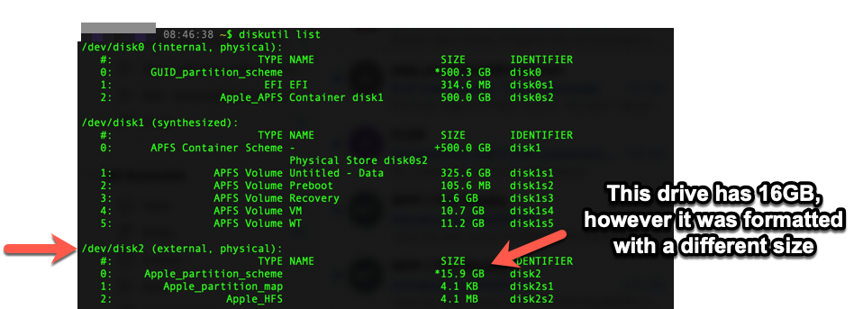

# How to fix an invalid flash drive size

I flashed an external drive and installed Ubuntu LiveCD on it. The drive capacity is 250GB
however after setting up the LiveCD, it reported much less than that.

I tried deleting the partition with `Disk Utility` howwever it wasn't able to mount the device due the incorrect drive size.

**Error** `The chosen size is not valid for the chosen file system. : (-69850)`

## How to fix it?
Quite simple acctually.
1. Look for the drive path
1. Reset / Re-write the drive

### List all drives attached
To do this I'm going to use ```diskutil``` command line tool.

**diskutil description**
```bash
diskutil manipulates the structure of local disks.  It provides information about, and allows the administration of, the partitioning schemes, layouts, and formats of disks. This includes hard disks, solid state disks, optical discs, disk images, APFS volumes, CoreStorage volumes, and AppleRAID sets.  It generally manipulates whole volumes instead of individual files and directories.
```

**List all drives**
```bash
> $ diskutil list
/dev/disk0 (internal, physical):
   #:                       TYPE NAME                    SIZE       IDENTIFIER
...

/dev/disk1 (synthesized):
   #:                       TYPE NAME                    SIZE       IDENTIFIER
...

/dev/disk2 (external, physical):   <===== THIS IS THE DRIVE I WANT TO RESET
   #:                       TYPE NAME                    SIZE       IDENTIFIER
   0:     Apple_partition_scheme                        *15.9 GB    disk2
   1:        Apple_partition_map                         4.1 KB     disk2s1
   2:                  Apple_HFS                         4.1 MB     disk2s2

```


### Rewrite the drive
In this case, I'm going to go over the drive and write zero's to it, this will not just erase everything but also remove any weird partition and tables.

```bash
$ diskutil zeroDisk /dev/disk2
Started erase on disk2
Finished erase on disk2
```

