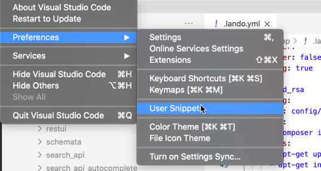
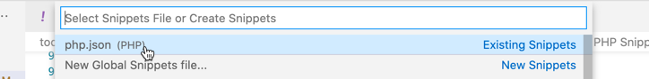

# Debugging Snippets

## DEBUG_PHP

**Description**:  DEBUG - Outputs and exit

### Zend Studio
```php
// DEBUG - START
echo "\n<pre>\n";
echo __FILE__ . '::' . __METHOD__ . '(' . __LINE__ . ")\n";
var_dump(${VAR_TO_DEBUG});
echo "\n</pre>\n";
exit;
// DEBUG - END

```

### Visual Studio
```javascript
  "DEBUG_PHP": {
    "prefix": "DEBUG_PHP",
    "body": [
      "// DEBUG - START",
      "echo \"\n<pre>\n\";",
      "echo __FILE__ . '::' . __METHOD__ . '(' . __LINE__ . \")\n\";",
      "var_dump(${VAR_TO_DEBUG});",
      "echo \"\n</pre>\n\";",
      "exit;",
      "// DEBUG - END"
    ],
    "description": "DEBUG - Prints and exit"
  }
```


## DEBUG_LOG

**Description**:  DEBUG - Print to PHP error log

### Zend Studio
```php
// DEBUG - START
error_log(__CLASS__ . '::' . __FUNCTION__ . '(' . __LINE__ . ')');
error_log('${TXT_VAR_TO_DEBUG} ' . print_r(${VAR_TO_DEBUG}, true));
// DEBUG - END
```

### Visual Studio
```javascript
  "DEBUG_LOG": {
    "prefix": "DEBUG_LOG",
    "body": [
      "// DEBUG - START"
      "error_log(__CLASS__ . '::' . __FUNCTION__ . '(' . __LINE__ . ')');"
      "error_log('$${1} ' . print_r($${1}, true));"
      "// DEBUG - END"
    ],
    "description": "DEBUG - Print to PHP error log"
  }
```


## DEBUG_BACKTRACE
**Description** Prints the debug backtrace

### Zend Studio
```php
// DEBUG - START
echo "\n<pre>\n";
echo __CLASS__ . '::' . __FUNCTION__ . '(' . __LINE__ . ")\n";
$$dbg_traces = debug_backtrace();
foreach($$dbg_traces as $$dbg_trace) {
    $$dbg_t = (isset($$dbg_trace['type'])) ? $$dbg_trace['type'] : null;
    $$dbg_l = (isset($$dbg_trace['line'])) ? "({$$dbg_trace['line']})" : null;
    $$dbg_f = (isset($$dbg_trace['file'])) ? $$dbg_trace['file'] : null;
    $$dbg_c = (isset($$dbg_trace['class'])) ? $$dbg_trace['class'] : null;
    echo "{$$dbg_c}{$$dbg_t}{$$dbg_trace['function']} {$$dbg_f}{$$dbg_l}\n";
}
echo "\n</pre>\n";
// DEBUG - END
```

### Visual Studio
```javascript
  "DEBUG_BACKTRACE": {
    "prefix": "DEBUG_BACKTRACE",
    "body": [
      "// DEBUG - START",
      "echo \"\\n<pre>\\n\";",
      "echo __CLASS__ . '::' . __FUNCTION__ . '(' . __LINE__ . \")\\n\";",
      "$dbg_traces = debug_backtrace();",
      "foreach($dbg_traces as $dbg_trace) {",
      "    $dbg_t = (isset($dbg_trace['type'])) ? $dbg_trace['type'] : null;",
      "    $dbg_l = (isset($dbg_trace['line'])) ? \"({$dbg_trace['line']})\" : null;",
      "    $dbg_f = (isset($dbg_trace['file'])) ? $dbg_trace['file'] : null;",
      "    $dbg_c = (isset($dbg_trace['class'])) ? $dbg_trace['class'] : null;",
      "    echo \"{$dbg_c}{$dbg_t}{$dbg_trace['function']} {$dbg_f}{$$dbg_l}\\n\";",
      "}",
      "echo \"\\n</pre>\\n\";",
      "// DEBUG - END"
    ],
    "description": "DEBUG_BACKTRACE - Prints the debug backtrace"
  }
  ```

## Visual Studio Full PHP Snipped JSON File




```javascript
{
	// Place your snippets for php here. Each snippet is defined under a snippet name and has a prefix, body and
	// description. The prefix is what is used to trigger the snippet and the body will be expanded and inserted. Possible variables are:
	// $1, $2 for tab stops, $0 for the final cursor position, and ${1:label}, ${2:another} for placeholders. Placeholders with the
	// same ids are connected.
	// Example:
	// "Print to console": {
	// 	"prefix": "log",
	// 	"body": [
	// 		"console.log('$1');",
	// 		"$2"
	// 	],
	// 	"description": "Log output to console"
  // }
  "DEBUG_PHP": {
    "prefix": "DEBUG_PHP",
    "body": [
      "// DEBUG - START",
      "echo \"\\n<pre>\\n\";",
      "echo __FILE__ . '::' . __METHOD__ . '(' . __LINE__ . \")\\n\";",
      "var_dump(${VAR_TO_DEBUG});",
      "echo \"\\n</pre>\\n\";",
      "exit;",
      "// DEBUG - END"
    ],
    "description": "DEBUG - Prints and exit"
  },
  "DEBUG_LOG": {
    "prefix": "DEBUG_LOG",
    "body": [
      "// DEBUG - START"
      "error_log(__CLASS__ . '::' . __FUNCTION__ . '(' . __LINE__ . ')');"
      "error_log('$${1} ' . print_r($${1}, true));"
      "// DEBUG - END"
    ],
    "description": "DEBUG - Print to PHP error log"
  },
  "DEBUG_BACKTRACE": {
    "prefix": "DEBUG_BACKTRACE",
    "body": [
      "// DEBUG - START",
      "echo \"\\n<pre>\\n\";",
      "echo __CLASS__ . '::' . __FUNCTION__ . '(' . __LINE__ . \")\\n\";",
      "$dbg_traces = debug_backtrace();",
      "foreach($dbg_traces as $dbg_trace) {",
      "    $dbg_t = (isset($dbg_trace['type'])) ? $dbg_trace['type'] : null;",
      "    $dbg_l = (isset($dbg_trace['line'])) ? \"({$dbg_trace['line']})\" : null;",
      "    $dbg_f = (isset($dbg_trace['file'])) ? $dbg_trace['file'] : null;",
      "    $dbg_c = (isset($dbg_trace['class'])) ? $dbg_trace['class'] : null;",
      "    echo \"{$dbg_c}{$dbg_t}{$dbg_trace['function']} {$dbg_f}{$$dbg_l}\\n\";",
      "}",
      "echo \"\\n</pre>\\n\";",
      "// DEBUG - END"
    ],
    "description": "DEBUG_BACKTRACE - Prints the debug backtrace"
  }
}
```
