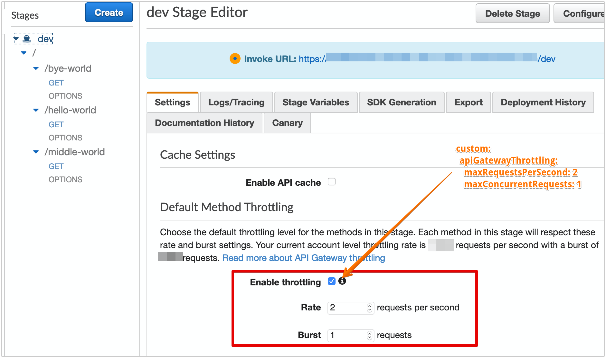

# Serverless - Create ApiGateway with custom Throttling

It took a while for me to figure this one out.

## Requirements
* Plugin: serverless-api-gateway-throttling

**serverless.yml**
```
service: testthrottling

plugins:
  - serverless-api-gateway-throttling

custom:
  apiGatewayThrottling:
    maxRequestsPerSecond: 2
    maxConcurrentRequests: 1

provider:
  name: aws
  runtime: nodejs12.x
  environment:
    STAGE: ${self:provider.stage}

functions:
  helloWorld:
    handler: handler.helloWorld
    events:
      - http:
          path: hello-world
          method: get
          cors: true
          # ---------------------------
          # --
          # -- CUSTOM METHOD THROTTLING
          # --
          # ---------------------------
          throttling:
            maxRequestsPerSecond: 3
            maxConcurrentRequests: 1

  byeWorld:
    handler: handler.byeWorld
    events:
      - http:
          path: bye-world
          method: get
          cors: true

```

# Results

## Stage Default Configuration with custom Throttling


## Method with custom Throttling

