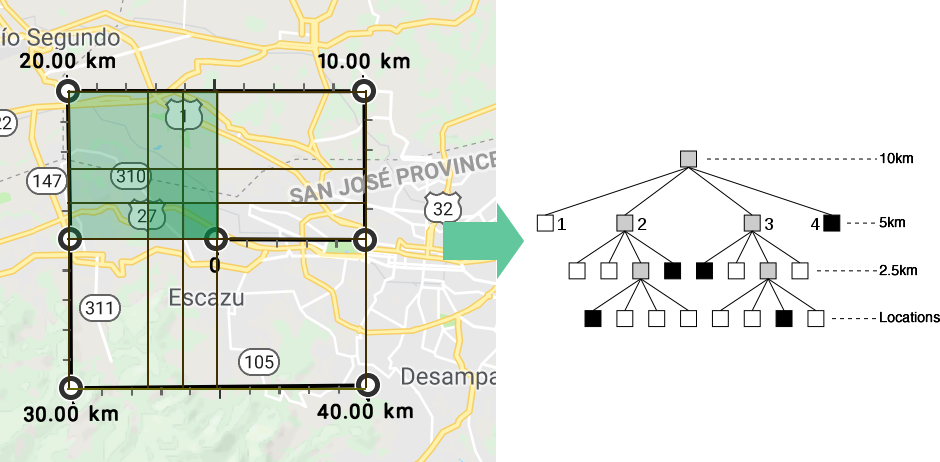

# Locations & Proximity Search Without Databases

## Summary
When I started a new feature for a project I was working on, I needed to deliver
via an API locations near the individual within a given range (5 miles).

While we have systems like databases that can do this type of work easily, it
does require a connection execute the query, wait for the results and then process
them. While this process can be handle easily, when you add multiple users doing
the same thing it can get a little problematic.

## Caching the request
Caching the request can be your first though, however, it can be a little complicated
because if you use Latituded and Longitud searches, their accuracy is at the centimeter
level, therefore it becomes an unusable solution, hence, not a solution.

# Quadtrees to the rescue
First than all, "What are Quadtrees anyway?" to put it simple, it's a
data structure in a tree form, in which each level down represents a smaller space.

Wikipedia offers the following definition:

> A quadtree is a tree data structure in which each internal node has exactly
> four children. Quadtrees are the two-dimensional analog of octrees and are
> most often used to partition a two-dimensional space by recursively subdividing
> it into four quadrants or regions. The data associated with a leaf cell varies
> by application, but the leaf cell represents a "unit of interesting spatial information".

[***Wikipedia - Quadtree***](https://en.wikipedia.org/wiki/Quadtree)

# Quadtrees in action
So, to put it in a simple way, imagine that you want to know all the points within
10km from your current location.

If we use Quadtrees, every location can be a data point in the tree, so once you have
all your points, you just need to define a bigger quadrant in which the search a
given search will return the matching points.

For example, this is my office location:

If I want to have all the locations that are within a 10km radius, I can define
a Quadrant that encapsulates them, that turns into:

# References
1. D’Angelo, A. 2016 A Brief Introduction to Quadtrees and Their Applications. Style file from the 28th Canadian Conference on Computational Geometry, 2016. 1-3.
1. Wikipedia. Quadtrees. [https://en.wikipedia.org/wiki/Quadtree]. Accessed August 25th, 2018.
