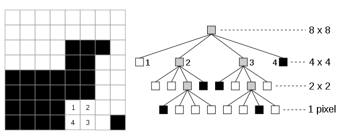
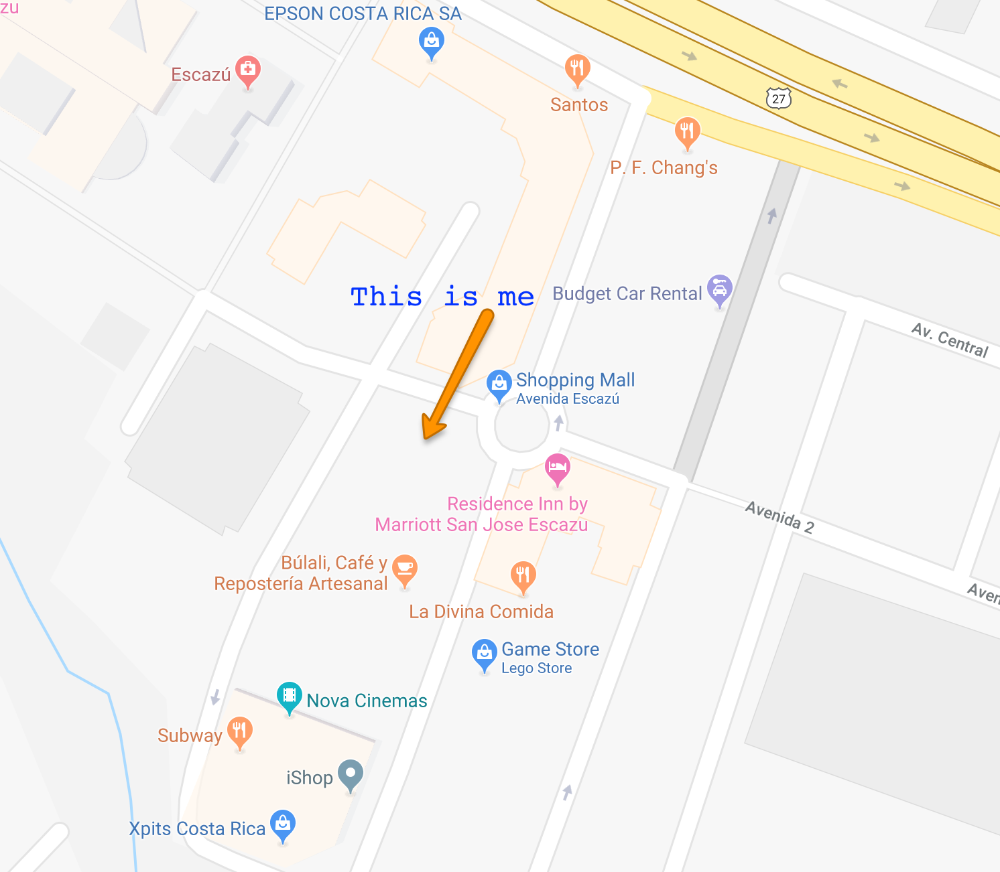
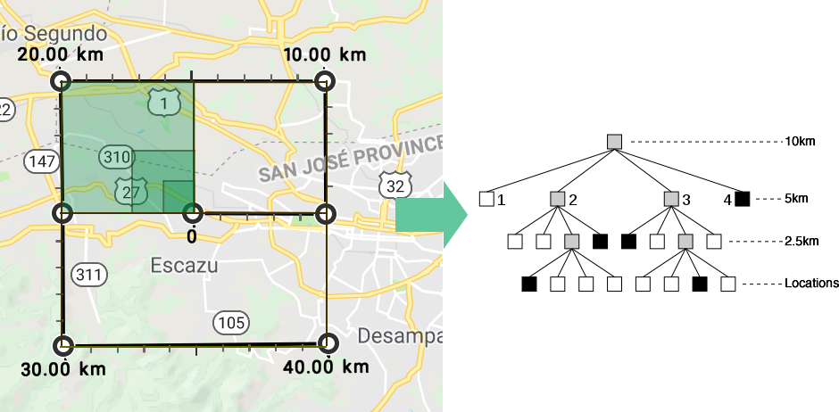

# Locations & Proximity Search Without Databases

## Summary
When I started a new feature for a project I was working on, I needed to deliver
via an API locations near the individual within a given range (5 miles).

While we have systems like databases that can do this type of work easily, it
does require a connection to execute the query, wait for the results and then process
them. This process is easily, however, when you add multiple users doing the same
thing it can get a little problematic.

## Caching the request
Caching the request can be your first though, however, it can be a little complicated
because if you use Latituded and Longitud searches, their accuracy is at the centimeter
level, therefore it becomes an unusable solution, hence, not a solution.

# Quadtrees to the rescue
First than all, **"What are Quadtrees anyway?"** to put it simple, it's a
data structure in a tree form, in which each level down represents a smaller space.



Wikipedia offers the following definition:

> A quadtree is a tree data structure in which each internal node has exactly
> four children. Quadtrees are the two-dimensional analog of octrees and are
> most often used to partition a two-dimensional space by recursively subdividing
> it into four quadrants or regions. The data associated with a leaf cell varies
> by application, but the leaf cell represents a "unit of interesting spatial information".


[***Wikipedia - Quadtree***](https://en.wikipedia.org/wiki/Quadtree)

# Quadtrees in action
So, to put it in a simple way, imagine that you want to know all the points within
10km from your current location.

If we use Quadtrees, every location can be a data point in the tree, so once you have
all your points, you just need to define a bigger quadrant in which the search a
given search will return the matching points.

For example, this is my office location:


If I want to have all the locations that are within 10km from where I'am, I can define
a Quadrant that encapsulates them, that turns into:




# Show me the code
For the following example, I'm going to use Mark Baker Quadtree implementation (https://github.com/MarkBaker)

## Location points

Lets assume these locations are in file called ```locations.csv```
```
POSSIBLE,Avenida Escazu, 9.9384693,-84.1431671
PFChangs,Avenida Escazu,9.9393797,-84.1422986
Saga Desserts,Avenida Escazu,9.938567,-84.1431215
Procomer,Plaza Tempo,9.9398292,-84.145805
Milá Bistró, Plaza Tempo,9.940101,-84.145472
Tintos y Blancos, Multiplaza,9.943562,-84.149817
Subway,Parque La Sabana,9.932550,-84.103607
Restaurante Prosperidad,Paseo Colón,9.935773,-84.094358
El Steinvorth,San José,9.934282,-84.078206
Trigo Miel,San José,9.934385,-84.077288
Café Ruiseñor,San Pedro,9.932561,-84.059613
Panes Artesanales Artemesia,La Paulina,9.940449,-84.051094
Sabor Celestial,Sabanilla,9.946737,-84.037643
Chef Sofía,Granadilla,9.931858,-84.026662
Crêperie Crepissima,Tres Ríos,9.902207,-83.996396
Winery ProAve,Cartago,9.891323,-83.941634
Chocolate Shop, Cartago,9.883301,-83.933840
```

## Create location points

Each location point will be encapsulated in a class with the respective data information:

### LocationPoint Class
```php
class LocationPoint extends \QuadTrees\QuadTreeXYPoint
{
    public $name;
    public $city;

    public function __construct($name, $city, $x, $y) {
        parent::__construct($x, $y);
        $this->name = $name;
        $this->city = $city;
    }
}
```

### Create base Quadtree
```php
//  Set the centrepoint of our QuadTree at 0.0 Longitude, 0.0 Latitude
$centrePoint = new \QuadTrees\QuadTreeXYPoint(0.0, 0.0);

//  Set the bounding box to the entire globe
$quadTreeBoundingBox = new \QuadTrees\QuadTreeBoundingBox($centrePoint, 360, 180);

//  Create our QuadTree
$quadTree = new \QuadTrees\QuadTree($quadTreeBoundingBox);
```

### Create individual locations
```php
$filename = 'locations.csv';
$locationFile = new \SplFileObject($filename);
$locationFile->setFlags(\SplFileObject::READ_CSV | \SplFileObject::DROP_NEW_LINE | \SplFileObject::SKIP_EMPTY);

foreach($locationFile as $location) {
    if (!empty($location[0])) {
        $city = new LocationPoint(
            $location[0],
            $location[1],
            $location[3],
            $location[2]
        );
        $quadTree->insert($city);
    }
}
```

### Search
```php
$iamLatitude = 9.938162;
$iamLongitude = -84.142934;

// 10 km width/height box
$width = 0.145;
$height = 0.145;

//  Create a bounding box to search in, centred on the specified longitude and latitude
$searchCentrePoint = new \QuadTrees\QuadTreeXYPoint($longitude, $latitude);

//  Create the bounding box with specified dimensions
$searchBoundingBox = new \QuadTrees\QuadTreeBoundingBox($searchCentrePoint, $width, $height);

//  Search the locations QuadTree for all entries that fall within the defined bounding box
$searchResult = $citiesQuadTree->search($searchBoundingBox);
```

# Search Notes
The search does require a small calculation for the box which is not a trivial task.

## Latitude & Longitude Accuracy
Latitudes and longitudes have an accuracy depending on how many decimals they have:

Lat/Long Decimal Points | Accuracy KM | Accuracy Miles
--- | --- | ---
33.0 | 111.32 km | 69.17 mi
33.9 | 11.132 km | 6.917 mi
33.97 | 1.1132 km | 0.6917 mi
33.977 | 111.32 m | 365.19 feet
33.9779 | 11.132 m | 36.519 fee
33.97791 | 1.1132 m | 3.6519 feet
33.977913 | 111.32 mm | 4.3826 inches
33.9779134 | 11.132 mm | 0.4382 inches

## Search quad
To be able to search for a Quadran of 10km, we need to know the size of it in location points.

These values can be calculated using the Harvesine function in either miles or kilometers.

```php
/**
 * Harvesine formula. Returns the distance between two given points.
 *
 * @param int $earthRadius Use k for kilometers or m for miles
 * @param float $latitude1
 * @param float $longitude1
 * @param float $latitude2
 * @param float $longitude2
 * @return float
 */
function harvesine(string $metric,
    float $latitude1,
    float $longitude1,
    float $latitude2,
    float $longitude2) {

    switch($metric) {
        case 'm' :
            $earthRadius = 3959;
            break;
        default
            $earthRadius = 6371;
    }

    $dLat = deg2rad($latitude2 - $latitude1);
    $dLon = deg2rad($longitude2 - $longitude1);

    $a = sin($dLat/2) *
        sin($dLat/2) +
        cos(deg2rad($latitude1)) *
        cos(deg2rad($latitude2)) *
        sin($dLon/2) *
        sin($dLon/2);

    $c = 2 * asin(sqrt($a));
    $d = $earthRadius * $c;

    return $d;
}

/**
 * Returns the quadrant size to use for a given size.
 *
 * @param int $quadSize
 *   Size in miles or kilometers
 *
 * @param string $metric
 *   m for miles or k for kilometers
 *
 * @return float
 */
function getDistance(int $quadSize, string $metric) {
    $metricValues = array('m','k');
    if (!in_array($metric, $metricValues)) {
        $metric = 'k';
    }


    $startLatitude = 42.594434;
    $startLongitude = 1.537490;

    for ($i = 0; $i < 1; $i += 0.001) {
        $finalLat = $startLatitude + ($i/2);
        $finalLon = $startLongitude + ($i/2);
        $distance = harvesine(
            $metric,
            $startLatitude,
            $startLongitude,
            $finalLat,
            $finalLon);

        if ($distance > $quadSize) {
            break;
        }
    }

    return $distance;
}

// Call it
$distanceRequired = 10;
$metric = 'k'; // KM

$distance = getDistance($distanceRequired, $metric); // 0.145 for a 10.008460185606 KM box

```

### Harvesine Formula
```
x = Δλ ⋅ cos φm
y = Δφ
d = R ⋅ √(x² + y²)
```
Where **R** is the earth radius:
* `3959` for miles
* `6371` for kilometers


# References
1. D’Angelo, A. 2016 A Brief Introduction to Quadtrees and Their Applications. Style file from the 28th Canadian Conference on Computational Geometry, 2016. 1-3.
1. Wikipedia. Quadtrees. [https://en.wikipedia.org/wiki/Quadtree]. Accessed August 25th, 2018.
1. Baker M. MarkBaker/QuadTrees [https://github.com/MarkBaker/QuadTrees]. Accesed August 25th, 2018.
1. Wikipedia. Harvesine Formula. [https://en.wikipedia.org/wiki/Haversine_formula]. Accesed August 25th, 2018.