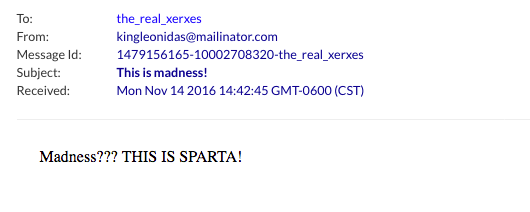

# Send Email From Terminal

Several ways of doint it. 

## Using Mail

Need to install `mail` which is included in the package `mailutils`:

```bash

sudo apt-get install mailutils

```

Now, you can just type: `mail recipient_email@domain.com` 

**Example**

```bash
$ mail recipient@domain.com
Cc:
Subject: This is Sparta
Tonight, we dine in hell!!

```

to finish the email and send it, need to type: `CRTL-D`


## Using Telnet

This one is simpler, just need to follow protocol:

1. Greet server: `HELO servername`
2. From who? `MAIL FROM: email_from@domain.com`
3. To who? `RCPT TO: to_who@domain.com`
4. What? (including subject): `DATA`

For the subject, type `Subject: Subject here...` and add **two** line changes, when done, finish with .

**Example**

```
telnet 127.0.0.1 25
Trying 127.0.0.1...
Connected to 127.0.0.1.
Escape character is '^]'.
220 precise64 ESMTP Sendmail 8.14.4/8.14.4/Debian-2ubuntu2.1; Mon, 14 Nov 2016 14:34:01 -0600; (No UCE/UBE) logging access from: localhost(OK)-localhost [127.0.0.1]
HELO greekserver
250 precise64 Hello localhost [127.0.0.1], pleased to meet you
MAIL FROM: kingleonidas@mailinator.com
250 2.1.0 kingleonidas@mailinator.com... Sender ok
RCPT TO: the_real_xerxes@mailinator.com
250 2.1.5 the_real_xerxes@mailinator.com... Recipient ok
DATA
354 Enter mail, end with "." on a line by itself
Subject: This is madness!

Madness??? THIS IS SPARTA!

.
250 2.0.0 uAEKY1Xl007527 Message accepted for delivery


```

### What I received




### Ubuntu Mail Logs

`/var/logs/mail.log` and `/var/log/mail.err`

```bash

Nov 14 14:42:33 precise64 sm-mta[7527]: uAEKY1Xl007527: from=kingleonidas@mailinator.com, size=55, class=0, nrcpts=1, msgid=<201611142041.uAEKY1Xl007527@precise64>, proto=SMTP, daemon=MTA-v4, relay=localhost [127.0.0.1]
Nov 14 14:42:46 precise64 sm-mta[7670]: uAEKY1Xl007527: to=the_real_xerxes@mailinator.com, delay=00:00:55, xdelay=00:00:11, mailer=esmtp, pri=120055, relay=mail2.mailinator.com. [45.33.83.75], dsn=2.0.0, stat=Sent (Ok)

```


## Sendmail

To install sendmail in Ubuntu:

```
sudo apt-get install sendmail
```