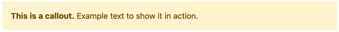
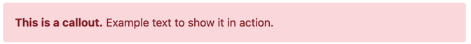
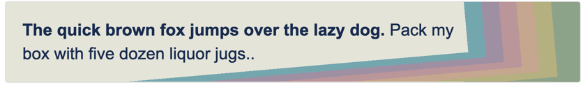

# Confluence Boxes

Sections or boxes for more appealing documentation.


## Callout - Info


```
<ac:structured-macro
  ac:name="divbox"
  ac:schema-version="1">
  <ac:parameter
    ac:name="style">font-family: Arial;font-size:1.5rem; padding:1.25rem; margin-top:1.25rem; margin-bottom: 1.25rem; border:1px solid #e9ecef; border-left-width: .25rem; border-radius:.25rem;border-left-color:#5bc0de;</ac:parameter>
  <ac:rich-text-body>
    <p><strong>This is an info callout.</strong> Example text to show it in action.</p>
  </ac:rich-text-body>
</ac:structured-macro>
```

## Callout - Warning


```
<ac:structured-macro
  ac:name="divbox"
  ac:schema-version="1">
  <ac:parameter
    ac:name="style">font-family: Arial;font-size:1.5rem; padding:1.25rem; margin-top:1.25rem; margin-bottom: 1.25rem; border:1px solid #e9ecef; border-left-width: .25rem; border-radius:.25rem;border-left-color:#f0ad4e;</ac:parameter>
  <ac:rich-text-body>
    <p><strong>This is an info callout.</strong> Example text to show it in action.</p>
  </ac:rich-text-body>
</ac:structured-macro>
```

## Callout - Danger


```
<ac:structured-macro
  ac:name="divbox"
  ac:schema-version="1"e>
  <ac:parameter
    ac:name="style">font-family: Arial;font-size:1.5rem; padding:1.25rem; margin-top:1.25rem; margin-bottom: 1.25rem; border:1px solid #e9ecef; border-left-width: .25rem; border-radius:.25rem;border-left-color:#d9534f;</ac:parameter>
  <ac:rich-text-body>
    <p><strong>This is an info callout.</strong> Example text to show it in action.</p>
  </ac:rich-text-body>
</ac:structured-macro>
```


# Alert Boxes


## Blue Box


```
<ac:structured-macro
  ac:name="divbox"
  ac:schema-version="1">
  <ac:parameter
    ac:name="style">font-size:1rem; color:#084298; background-color:#cfe2ff; border-color:#b6d4fe;
position:relative; padding: 1rem 1rem; margin-bottom: 1rem; border: 1px solid transparent; border-radius:.25rem;
box-sizing:border-box</ac:parameter>
  <ac:rich-text-body>
    <p><strong>This is a callout.</strong> Example text to show it in action.</p>
  </ac:rich-text-body>
</ac:structured-macro>
```

## Green Box


```
<ac:structured-macro
  ac:name="divbox"
  ac:schema-version="1">
  <ac:parameter
    ac:name="style">font-size:1rem; color:#0f5132; background-color:#d1e7dd; border-color:#badbcc;
position:relative; padding: 1rem 1rem; margin-bottom: 1rem; border: 1px solid transparent; border-radius:.25rem;
box-sizing:border-box</ac:parameter>
  <ac:rich-text-body>
    <p><strong>This is a callout.</strong> Example text to show it in action.</p>
  </ac:rich-text-body>
</ac:structured-macro>
```

## Yellow Box


```
<ac:structured-macro
  ac:name="divbox"
  ac:schema-version="1">
  <ac:parameter
    ac:name="style">font-size:1rem; color:#664d03; background-color:#fff3cd; border-color:#ffecb5;
position:relative; padding: 1rem 1rem; margin-bottom: 1rem; border: 1px solid transparent; border-radius:.25rem;
box-sizing:border-box</ac:parameter>
  <ac:rich-text-body>
    <p><strong>This is a callout.</strong> Example text to show it in action.</p>
  </ac:rich-text-body>
</ac:structured-macro>
```

## Red Box


```
<ac:structured-macro
  ac:name="divbox"
  ac:schema-version="1">
  <ac:parameter
    ac:name="style">font-size:1rem; color:#842029; background-color:#f8d7da; border-color:#f5c2c7;
position:relative; padding: 1rem 1rem; margin-bottom: 1rem; border: 1px solid transparent; border-radius:.25rem;
box-sizing:border-box</ac:parameter>
  <ac:rich-text-body>
    <p><strong>This is a callout.</strong> Example text to show it in action.</p>
  </ac:rich-text-body>
</ac:structured-macro>
```


# Fancy Boxes


## Colorful Box

```
<ac:structured-macro
  ac:name="divbox"
  ac:schema-version="1">
  <ac:parameter
    ac:name="style">font-family: Arial;font-size: 1.5rem;padding: 1em;padding-right:20%;width: 100%;min-height:100px;box-sizing: border-box;border-radius: .25rem;background-color: #e4e4d9;background-image: linear-gradient(175deg, rgb(0 0 0 / 0%) 95%, #8da389 95%),linear-gradient( 85deg, rgb(0 0 0 / 0%) 95%, #8da389 95%),linear-gradient(175deg, rgb(0 0 0 / 0%) 90%, #b4b07f 90%),linear-gradient( 85deg, rgb(0 0 0 / 0%) 92%, #b4b07f 92%),linear-gradient(175deg, rgb(0 0 0 / 0%) 85%, #c5a68e 85%),linear-gradient( 85deg, rgb(0 0 0 / 0%) 89%, #c5a68e 89%),linear-gradient(175deg, rgb(0 0 0 / 0%) 80%, #ba9499 80%),linear-gradient( 85deg, rgb(0 0 0 / 0%) 86%, #ba9499 86%),linear-gradient(175deg, rgb(0 0 0 / 0%) 75%, #9f8fa4 75%),linear-gradient( 85deg, rgb(0 0 0 / 0%) 83%, #9f8fa4 83%),linear-gradient(175deg, rgb(0 0 0 / 0%) 70%, #74a6ae 70%),linear-gradient( 85deg, rgb(0 0 0 / 0%) 80%, #74a6ae 80%);</ac:parameter>
  <ac:rich-text-body>
    <p><strong>The quick brown fox jumps over the lazy dog.</strong> Pack my box with five dozen liquor jugs..</p>
  </ac:rich-text-body>
</ac:structured-macro>
```